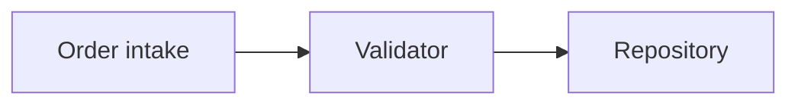

# Markdown Report Format

Write each architecture review as one self-contained Markdown file in the OS temp directory. Use Markdown headings, tables, lists, fenced Mermaid diagrams, and ASCII sketches only.

## Header

Start with the repository name and date. Add a compact legend when it helps: `[]` = module, `- - -` = seam, `-->` = leakage, `██` = deep module. Do not add an introduction paragraph.

## Candidate section

Use one `##` section per candidate:

````markdown
## Deepen Order intake

**Recommendation:** Strong  
**Dependency category:** in-process  
**Files:** `src/order.ts`, `src/pricing.ts`

### Before



### After

```text
[Caller] --> ██ Order intake ██
             validation + pricing + persistence
```

**Problem:** Order intake is shallow; pricing leaks across the seam.

**Solution:** Deepen the module behind one interface.

**Benefits:**
- locality: bugs concentrate in one module
- leverage: one interface, N call sites
- tests cross one seam
````

Keep prose sparse and plain. Use the `/codebase-design` vocabulary exactly: module, interface, implementation, depth, deep, shallow, seam, adapter, leverage, locality. Do not substitute component, service, API, signature, or boundary.

Use Mermaid for graph-shaped relationships. Use an ASCII sketch for cross-sections, mass diagrams, or call-graph collapses. Do not embed HTML, CSS, SVG, JavaScript, or CDN assets.

## Top recommendation

End with `## Top recommendation`, link to one candidate heading, and give one sentence on why it should be tackled first.
