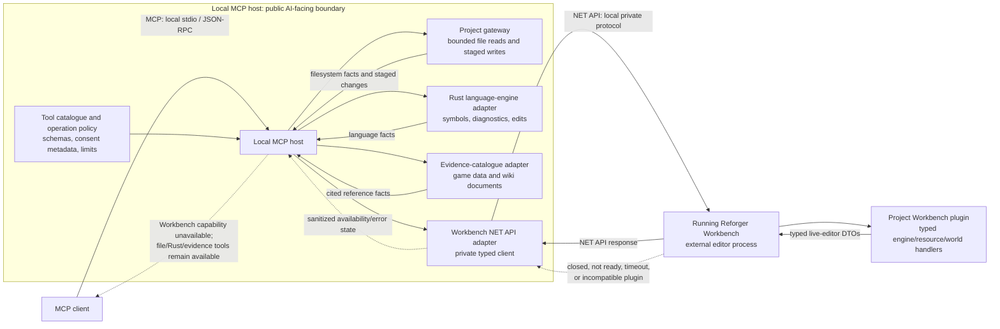

# Architecture

## Purpose

The system separates VS Code integration from language understanding. The
extension shell owns editor and storage integration; the bundled Rust server
owns all Enfusion language decisions.

## Runtime Flow

```text
VS Code editor
  -> TypeScript extension shell
  -> TypeScript language-client bridge
  -> bundled Rust language server
  -> LSP results
  -> VS Code editor
```

Game data and workspace scripts enter through resolved paths and document/file
notifications. The server turns them into immutable language facts; the client
renders or transports the resulting editor behavior.

When the extension installs game data or the user selects a manual source, the
top-level wiring requests a language-server restart. The replacement server then
builds its external game-data layer from that source; game-data acquisition does
not perform language analysis itself.

## Workbench Runtime and Proposed MCP Flow

The local MCP server described here is a future integration boundary, not part
of the current language-server runtime. It must preserve the same ownership
rules: Rust remains the Enfusion language authority, direct files remain the
authority for durable workspace content, and Workbench remains the authority
for live editor/engine facts.



The NET API is not part of MCP and is not exposed as a second public server. It
is a private adapter route from the local MCP host to the external Workbench
process. The custom plugin runs inside Workbench, not in the MCP host. A
Workbench failure therefore removes only manifest-backed editor capabilities;
it must not prevent filesystem, language-engine, or evidence-catalogue tools
from operating.

The extension's first Workbench feature uses the same private route through a
host-neutral Workbench Gateway. The extension hosts that Gateway initially for
compiler validation; a future MCP host adapts the Gateway rather than creating
another NET API implementation. The Gateway exposes named typed capabilities,
never arbitrary handler dispatch.

| Boundary | Request/data flow | Failure handling |
| --- | --- | --- |
| MCP client ↔ local MCP host | Named MCP tools/resources and structured results. | The host returns a typed unavailable/error result with a recovery hint. |
| MCP host ↔ files/Rust/evidence | Direct bounded reads, staged writes, language queries, and cited reference queries. | Preserve each source's own diagnostics; do not substitute Workbench facts. |
| MCP host ↔ NET API adapter | The host selects a named allowed capability; the adapter owns codec, timeout, retry, and connection handling. | Sanitize/log the transport category, clear the Workbench capability allowlist, and resume discovery. |
| NET API adapter ↔ Workbench plugin | Versioned request/response DTOs for editor/resource/world operations. | A missing, stale, or incompatible plugin marks its operations unavailable; never fall back to raw handler dispatch or guessed file semantics. |

MCP result objects must identify the source of each fact: `filesystem`,
`language-engine`, `evidence-catalogue`, or `workbench`. A result may combine
sources, but it must not imply that a file-derived fact describes current live
Workbench state.

## Module Boundaries

| Module | Owns | Must not own |
| --- | --- | --- |
| `src/extension.ts` | Activation and top-level wiring | Language behavior or game-data workflows |
| `src/extensionConfig/` | Extension-facing names, defaults, and limits | Runtime logic |
| `src/gameData/` | Game-data acquisition and source resolution | Parsing or semantic analysis |
| `src/languageClient/` | Server lifecycle, transport, file notifications, and thin editor bridges | Syntax, lookup, completion ranking, or type reasoning |
| `src/workbenchGateway/` | Host-neutral NET API codec, configured-endpoint transactions, typed Workbench capabilities, availability state, deadlines, and sanitized outcomes | VS Code imports, editor scheduling/UI, raw endpoint dispatch, or Enfusion language decisions |
| `src/workbenchCompiler/` | VS Code settings, save/validation scheduling, compiler diagnostic rendering, and Workbench status UI | NET API framing, endpoint discovery, or language-engine diagnostics |
| `server/` | Language analysis, external indexes, formatting, diagnostics, and LSP results | VS Code UI, settings, or game-data acquisition |
| `tools/` | Development and investigation support | Extension runtime behavior |

`src/extension.ts` composes these modules; it is not a feature owner.

Workbench compiler diagnostics are an extension-owned source, separate from
the Rust language server's provisional parser diagnostics. A future MCP host
may consume the normalized Workbench results, but it must not use the Gateway
to emulate compiler facts from files or expose the NET API as a public server.

## Workbench Compiler Validation

The extension constructs a new short-lived TCP connection for each Gateway
operation. `getStatus()` and `validateScripts(profile)` are the complete public
Gateway capability surface for the initial feature. The Gateway validates the
configured loopback endpoint, owns the proprietary framing and response
decoding, applies capability-specific absolute wall-clock deadlines, and
returns typed failures. Response activity cannot extend a transaction beyond
its deadline. The response error-code string is successful only when it is
exactly `Ok`; every other value is a typed Workbench failure. The Gateway
reports only sanitized capability names, outcomes, and timings to the
extension diagnostic log.

The compiler adapter probes the exact configured endpoint immediately, retries
an unavailable endpoint once per second, and uses a five-second heartbeat
while connected. Any successful status transaction means the Workbench API is
connected and validation remains available. `ScriptsCompiled` is presented as
compiler state; it does not downgrade API availability because live Workbench
uses `false` for completed compilation failures as well as incomplete
compilation. Configuration changes replace the Gateway generation immediately;
queued work and results from older generations cannot publish. Controller
disposal likewise invalidates in-flight continuations so they cannot publish or
restart polling after extension deactivation. The extension never scans for
another port or rewrites endpoint settings.

The first successful status probe in an extension session schedules one startup
validation so compiler state is established without waiting for a save or edit.
A validation that already completed earlier in that session satisfies this
requirement. The startup attempt is not re-armed by heartbeats, reconnects, or
configuration changes, and a transport failure does not create a retry loop.
This one operation is independent of the idle-delay setting and never saves a
dirty document.

Continuous validation is single-flight. With a positive idle delay, an
eligible save cancels any pending idle timer and validates immediately. Unsaved
typing uses the delay as a fallback: after the active dirty Enfusion Script has
been idle for that period, the adapter saves only that document and validates
the configured profile. The adapter suppresses the save event it initiated so
one idle trigger cannot produce a duplicate validation. A zero delay disables
edit/save automation after the session's startup validation. Triggers during a
validation collapse into one follow-up operation. A failed save does not call
Workbench and does not retry compilation until another user or editor trigger
occurs. When another edit arrives during an in-flight validation, it supersedes
earlier queued triggers so the single follow-up cannot begin before the newest
idle interval has elapsed; an explicit save bypasses that remaining idle wait.

Each completed validation is one atomic compiler diagnostic set. A successful
clean result removes the old Workbench set; a failed transaction retains it.
Newer edits, configuration changes, and Workbench outages re-render retained
findings as explicitly stale. A connected `ScriptsCompiled: false` status does
not stale a completed validation result. Because validation is
configuration-wide, a result also remains stale while any eligible workspace
script is dirty, even when the adapter successfully saved the active script
that triggered the run. The adapter projects a location only when its canonical
path exists inside the single addon workspace. An explicit external absolute
path is never replaced by a plausible relative guess. Workbench returns a
one-based source line without a column. For the VS Code underline, the adapter
reads that saved source line and selects a uniquely occurring subject quoted by
the compiler message when available; otherwise it selects the complete
non-whitespace content of the line. It never deliberately underlines leading
or trailing whitespace. For Workbench's specific missing-semicolon
broken-expression recovery message, the primary range stays on the reported
line's non-whitespace content. The nearest preceding non-blank source line is
attached as separate diagnostic related information. No primary compiler range
crosses a line boundary, because a continuous VS Code range would necessarily
underline intervening indentation, blank lines, and newlines. Rust language
diagnostics remain in their independent LSP-owned collection throughout.

Once the `ValidateScripts` call is dispatched, the dedicated **Reforger
Workbench Compiler** output atomically shows a timestamped one-line state that
the compilation was requested and the extension is waiting for Workbench. A
completed response replaces that transient state with the result; a failed
transaction replaces it with a terminal no-result message so the output never
continues to claim that Workbench is running. The completed result's compact
first line begins with a bracketed local 24-hour completion timestamp, then
reports Workbench request duration, project error/warning counts, and a count
of hidden non-project findings. The next line explicitly reports whether
Workbench returned a successful or failed validation. Detailed trigger, queue,
save, and Workbench timing stages remain in the sanitized extension diagnostic
log without source paths, messages, or payload data; they are not shown in the
end-user compiler output.
Project-contained findings show a workspace-relative `path:line`, severity,
and compiler message. Everything after the severity is one document link to
the projected diagnostic range; absolute paths are kept out of the displayed
result. Activating the link runs a private extension command that opens the
source in preview, selects that same range, places the active cursor at its
start, and reveals it in the editor. The command accepts only an opaque ID for
a current output link, so it cannot open an arbitrary path or a superseded
result.
Unmapped finding details remain in the typed Gateway result and are represented
only by sanitized counts in logging and user output. Manual validation reveals
the output, and automatic validation reveals it when project-contained
findings exist.

The Gateway normalizes diagnostics with the same message and source
identity/location in one Workbench response before the extension projects or
renders them. If Workbench returns both error and warning copies, error wins.
Different messages, locations, or source identities remain distinct findings.

`package.json` is the single foreground owner for the dark-oriented Reforger
Semantic Palette. It contributes Enforce-qualified native VS Code semantic
token rules instead of a complete theme, so the user retains their selected
theme and may override or disable the palette through normal VS Code settings.
The Rust server owns the semantic-token legend and classifications but emits no
foreground values. Hover Markdown is not an editor semantic-token surface, so
Rust marks hover fragments with semantic roles and the hover bridge applies
foregrounds resolved from the same effective native VS Code setting. This
keeps command links from substituting the workbench link color without
creating a second palette. The editor shell does not generate settings or
apply foreground decorations.

Within the language-client bridge, the composition root retains server lifecycle
and restart policy. Focused bridges own workspace-script notifications, hover
rendering, diagnostic command UI, development-server watching, completion UI
transactions, typing-assist transactions, and active scope-delimiter
presentation. The scope-delimiter bridge forwards current carets to the
version-aware Rust request and applies the returned ranges with the standard
theme bracket-match background and border; semantic-token rules retain sole
ownership of foreground presentation. The single application-scoped
bracket-coloring setting selects semantic-owner colors, Reforger punctuation,
or native VS Code presentation consistently across VS Code windows.
The language client synchronizes VS Code's language-specific bracket-coloring
and matching controls with that mode and restarts the server with the same
selection. Semantic-owner and punctuation modes disable native presentation
and retain the custom active-pair bridge; native mode emits no custom delimiter
foregrounds and does not register that bridge. Structural bracket typing is
unchanged. Typing-assist bridges share a small
versioned editor-edit transaction contract while retaining their own trigger
and Rust request policy. Each bridge transports Rust-authored facts or applies
editor behavior; none interprets Enfusion source.

The hover debug command combines two boundaries in one report: the TypeScript
bridge records the active theme, effective semantic-highlighting state, and
resolved role foregrounds; Rust records token classification, symbol
resolution, and the role-marked hover Markdown. This makes presentation
failures distinguishable from language-classification failures without logging
source outside the existing explicit debug artifact.

Within the LSP, transport framing, incoming-message scheduling, request routing,
runtime scheduling, background-event publication, response writing, operational
logging, request-local document-query admission, and feature projection are
separate concerns. A document query captures both the open-document snapshot
and the external-index snapshot at the request boundary so downstream feature
code cannot accidentally combine facts from different generations. Logging is
best-effort observation; it cannot participate in request admission or response
delivery.

The Document Runtime owns the mutable lifecycle of open-document snapshots:
admission, cancellation, deferred document-backed work, semantic-token refresh
state, semantic-token projection selection, and query capture. Request routing
decodes supported lifecycle, document, workspace, and feature payloads into
typed commands before dispatch. Background-event interpretation and request
routing are short-lived coordinator contracts invoked by the composition root;
they do not own durable server state. The composition root is the only owner of
JSON-RPC framing and delivers typed runtime effects such as notifications and
asynchronous responses.

LSP tests live in a test-only child module rather than the production
composition root. They are organized by observable behavior domains—protocol,
documents, runtime, and features—and use framed LSP traffic by default. A
separate test module may use only narrow `#[cfg(test)]` seams where deterministic
runtime or document-state setup cannot be observed through the protocol.

## Language Engine

The Rust engine is organized as a compiler-style pipeline:

```text
source text
  -> lexer and parser
  -> syntax and semantic file
  -> scopes and symbol indexes
  -> resolver/type facts
  -> LSP feature projection
```

Features such as completion, hover, definition, signature help, diagnostics,
semantic tokens, and formatting consume shared engine facts. They must not
create separate language models or move language rules into TypeScript.

## State and Concurrency

Open documents are immutable, revisioned snapshots. The analysis runtime owns
their admission, cancellation, and publication. A feature may use facts proven
for the current snapshot, but must never pair current text with stale local
semantic facts.

Workspace and game-data indexes are separate immutable external layers. A
feature captures one layer snapshot for a request; background indexing may
publish a later generation without changing that request's meaning.

## Change Rules

- Put a change in the module that owns its contract.
- Preserve one language authority: Rust.
- Add a cross-module path only when a concrete contract requires it.
- Keep editor bridges event-driven and narrow; they transport or apply
  Rust-authored results rather than classify source.
- Keep expensive analysis out of extension activation and the editor UI path.
- Keep a future MCP host as an adapter: it may compose file, Rust, evidence,
  and Workbench facts, but it must not become a second Enfusion semantic engine
  or expose raw NET API handler dispatch.
