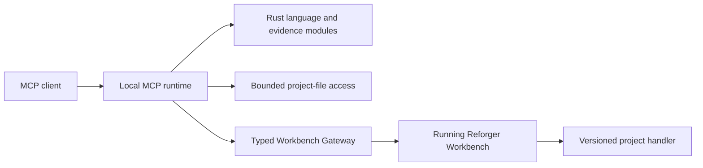

# Architecture

## Purpose

The system separates VS Code integration from language understanding. The
extension shell owns editor and storage integration; the bundled Rust server
owns Enfusion language decisions. This boundary keeps editor behaviour useful
without creating a second language implementation in TypeScript.

## Runtime Flow

```text
VS Code editor
  -> TypeScript extension shell
  -> TypeScript language-client bridge
  -> bundled Rust language server
  -> LSP results
  -> VS Code editor
```

Game data and workspace scripts enter through resolved paths and document/file
notifications. Rust turns them into immutable language facts; the client
transports or presents the resulting editor behaviour. Game-data acquisition
only resolves source material—it does not analyse Enfusion.

The packaged executable also has an independent MCP mode. An MCP client starts
its own local `stdio` process; it neither attaches to the editor-owned LSP nor
requires VS Code to remain running. LSP and MCP reuse the same Rust language
and evidence modules, so they do not establish competing semantic authorities.
The generated [MCP API Reference](mcp-api.md) is the public tool contract.

## MCP and Workbench Boundary

MCP tools may combine bounded project-file facts, language-engine facts, and
packaged evidence. Each result must identify its source and must not present a
file-derived fact as live Workbench state.

Workbench is the authority for running-editor and engine facts. Its NET API is
a private route to Workbench, never a second public MCP server or a generic
handler proxy. A missing or incompatible Workbench integration makes only the
affected live capability unavailable; it must not block offline language or
evidence tools.



The Workbench Gateway exposes named, typed capabilities. It owns the private
NET API boundary; hosts own their own presentation and scheduling. An MCP
Workbench adapter must consume this boundary rather than reimplementing the
codec or exposing arbitrary handler dispatch. Detailed protocol evidence and
compiler-validation acceptance remain in the relevant research journals.

## Module Boundaries

| Module | Owns | Must not own |
| --- | --- | --- |
| `src/extension.ts` | Activation and top-level wiring | Language behaviour or game-data workflows |
| `src/extensionConfig/` | Extension-facing names, defaults, and limits | Runtime logic |
| `src/gameData/` | Game-data acquisition and source resolution | Parsing or semantic analysis |
| `src/languageClient/` | Server lifecycle, transport, file notifications, and thin editor bridges | Syntax, lookup, completion ranking, or type reasoning |
| `src/mcp/` | MCP client configuration from the packaged runtime and stable source/cache inputs | Protocol serving, indexing, or semantic queries |
| `src/workbenchNetApi/gateway/` | Host-neutral NET API codec and typed Workbench capabilities | VS Code UI, raw endpoint dispatch, or Enfusion language decisions |
| `src/workbenchNetApi/compiler/` | VS Code scheduling, compiler diagnostic rendering, and Workbench status UI | NET API framing, endpoint discovery, or language-engine diagnostics |
| `server/src/bin/reforger_language_server.rs` | Process-mode parsing and dispatch to one protocol adapter | Protocol behaviour, language analysis, or tool definitions |
| `server/src/lsp/` | LSP transport, document lifecycle, and language-feature projection | MCP serving or a second Enfusion analysis implementation |
| `server/src/mcp/` | MCP schemas, protocol serving, and bounded result mapping | LSP lifecycle or a second Game Data/Official Wiki authority |
| `server/src/*.rs` (except protocol adapters) | Shared Enfusion analysis, evidence catalogues, indexes, formatting, and diagnostics | VS Code UI, settings, or client-protocol ownership |
| `tools/` | Development and investigation support | Extension runtime behaviour |

`src/extension.ts` composes modules; it is not a feature owner. Workbench
compiler diagnostics are extension-owned evidence, separate from Rust parser
diagnostics. They may be consumed by an MCP Workbench adapter, but never used
to emulate compiler facts from files.

## Engine Invariants

- Rust is the one Enfusion language authority.
- Open documents and external indexes are revisioned immutable snapshots; a
  request uses facts from the snapshot it captured.
- TypeScript bridges transport Rust-authored facts or apply editor behaviour;
  they do not classify source.
- Evidence follows the source hierarchy in [the system overview](overview.md).
- Workbench capabilities are typed and versioned; raw NET API handler dispatch
  is not an extension point.

Exact algorithms, scheduling, protocol framing, cache behaviour, and feature
results belong to code and tests. This document records the boundaries that
make changes to those details safe.
