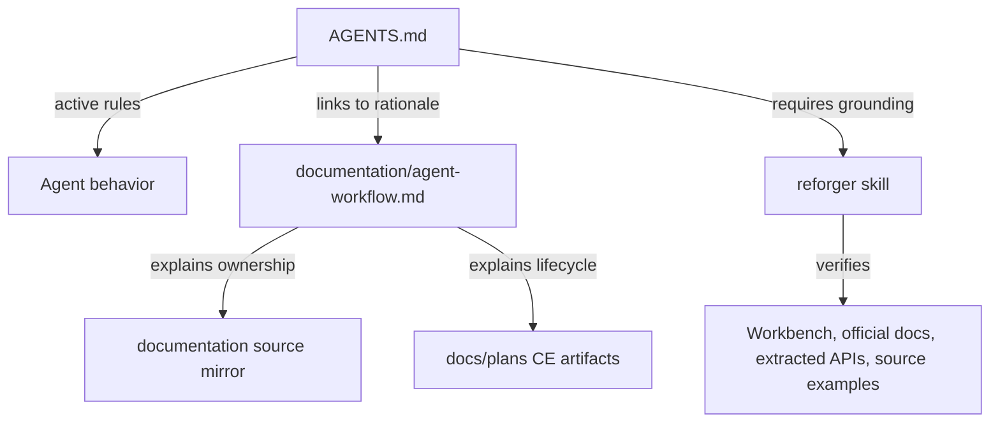

# Agent Policy and CE Workflow Refactor - Plan

## Goal Capsule

| Field | Plan |
|---|---|
| Objective | Refactor `AGENTS.md` into a strict active agent policy and move explanatory workflow rationale into linked documentation without losing current architectural knowledge. |
| Product authority | User decision in this session: use a strict `AGENTS.md` plus linked rationale docs. |
| Execution profile | Docs-only repository change touching agent policy and maintainer-facing workflow documentation. |
| Stop conditions | Stop if the refactor would weaken Reforger truth rules, erase current source ownership guidance without replacement, or make CE planning artifacts compete with `documentation/` source-mirror docs. |
| Tail ownership | The implementing agent updates docs and verifies markdown/path integrity; no source build is required unless implementation touches code or package metadata. |

---

## Product Contract

### Summary

The repository needs an agent architecture that supports Compound Engineering without making `AGENTS.md` a long mixed policy-and-rationale document. The refactor should preserve useful current doctrine, make hard rules easier for agents to obey, and allow harmful or obsolete documentation to be rewritten instead of preserved as legacy weight.

### Problem Frame

`AGENTS.md` currently contains active policy, architectural rationale, source organization, verification rules, Reforger truth rules, and explanatory documentation philosophy in one file. That is useful context, but it makes the hot-path agent contract harder to scan and increases the chance that future agents treat rationale, examples, and future intentions as equally mandatory. CE adds a better lifecycle for scoped work through `docs/plans/`, so the repo should clarify which documents own policy, plans, rationale, and source ownership.

### Requirements

**Policy Shape**

- R1. `AGENTS.md` must become a strict active policy document focused on rules agents must obey during repository work.
- R2. `AGENTS.md` must link to supporting rationale docs instead of carrying long-form explanations inline.
- R3. The refactor must preserve current high-value constraints around marketplace self-containment, TypeScript/Rust/LSP boundaries, Workbench truth, documentation reads, and verification.
- R4. The policy must allow deleting or rewriting documentation that encodes detrimental legacy architecture, while preserving documentation that describes current ownership, behavior, or decision context.

**Compound Engineering Workflow**

- R5. The docs must define CE artifact ownership: `ce-brainstorm` for requirements-level product scope, `ce-plan` for implementation-ready slices, and `ce-work`/debug/review/commit skills for execution and shipping.
- R6. `docs/plans/` must be described as the home for CE plan artifacts, not as a replacement for source-mirror documentation.
- R7. `documentation/` must remain the canonical home for internal contributor and agent context tied to source ownership and subsystem behavior.

**Reforger Grounding**

- R8. The policy must require the `reforger` skill before reasoning about or changing Arma Reforger, Enfusion Script, Workbench, game-data, extracted APIs, examples, fixtures, parser, model, index, diagnostics, formatting, or LSP language behavior.
- R9. The policy must keep Workbench/compiler behavior as final authority and forbid inference from C#, Unity, Unreal, Arma 3, SQF, or generic scripting languages.

### Scope Boundaries

- In scope: rewriting `AGENTS.md`, adding a linked workflow rationale document, and preserving the current doc-reading and verification expectations in clearer form.
- In scope: documenting how CE artifacts relate to `documentation/` and future `CONCEPTS.md` usage.
- Deferred: creating `CONCEPTS.md`; that is owned by CE compound/refresh workflows when project-specific vocabulary needs durable capture.
- Out of scope: changing TypeScript, Rust, package scripts, extension behavior, marketplace packaging, or Reforger language implementation.

### Acceptance Examples

- AE1. Given an agent starts a future Reforger parser task, when it reads `AGENTS.md`, then it sees a direct requirement to use the `reforger` skill and source-backed Reforger evidence before reasoning or editing.
- AE2. Given an agent starts a vague architecture change, when it reads `AGENTS.md`, then it sees that CE brainstorm and CE plan own scoping and implementation planning before broad edits.
- AE3. Given a future source change touches `server/src/parser.rs`, when an agent reads policy, then it still knows to read matching source-mirror documentation before planning or editing.
- AE4. Given old documentation preserves a harmful architecture direction, when an agent updates the docs, then policy permits rewriting or deleting that stale content with clear replacement context instead of preserving it blindly.

---

## Planning Contract

### Key Technical Decisions

- KTD1. Make `AGENTS.md` strict policy and move rationale into linked docs. (session-settled: user-directed - chosen over a combined policy-plus-rationale document: the strict policy shape is easier for agents to obey and avoids preserving legacy explanation as active instruction.)
- KTD2. Keep `documentation/` as source-mirror context and introduce `documentation/agent-workflow.md` as the CE/workflow rationale owner. This avoids mixing transient plan artifacts with durable source ownership docs.
- KTD3. Treat `docs/plans/` as CE artifact storage only. Plans explain scoped work and implementation slices; they do not replace mirrored docs and should not be copied into `documentation/`.
- KTD4. Preserve the Reforger skill trigger as a hard policy. The refactor may shorten the wording, but it must not weaken the requirement to verify syntax, APIs, examples, game data, and Workbench behavior through the `reforger` skill and source-backed evidence.
- KTD5. Use docs-only verification. Since this plan changes markdown policy and rationale only, `git diff --check` plus manual link/path review is the relevant verification floor unless implementation expands into code or package metadata.

### High-Level Technical Design

### System-Wide Impact

This refactor changes the repository's agent operating contract. It does not change runtime behavior, but it affects how future agents plan, edit, verify, and preserve documentation. The highest-risk failure mode is accidentally weakening mandatory Reforger grounding or making CE artifacts look authoritative over source-mirror docs.

### Assumptions

- `documentation/agent-workflow.md` does not currently exist and can be added as a non-trivial rationale document with a clear owner.
- `docs/plans/` already exists for this plan artifact and should be documented as CE artifact storage.
- The current `AGENTS.md` content is the source material for the refactor, but the implementation may rewrite or relocate text instead of preserving sentence-level wording.

---

## Implementation Units

### U1. Classify Current AGENTS Content

- **Goal:** Build a keep/move/rewrite/delete map for the existing `AGENTS.md` before editing.
- **Requirements:** R1, R2, R3, R4
- **Files:** `AGENTS.md`
- **Approach:** Read `AGENTS.md` in full and classify each section by destination: active policy, workflow rationale, source-mirror rule, or removable legacy detail. Preserve non-negotiable constraints even when wording changes.
- **Test Scenarios:** Confirm every current section has an intentional disposition; confirm no retained hard rule becomes weaker in the classification.
- **Verification:** Manual section map review before edits.

### U2. Rewrite AGENTS.md as Strict Active Policy

- **Goal:** Replace the mixed policy/rationale document with a shorter active contract.
- **Requirements:** R1, R2, R3, R5, R8, R9
- **Files:** `AGENTS.md`
- **Approach:** Organize the file around mandatory repository mission, architecture boundaries, skill routing, documentation policy, verification policy, runtime packaging policy, and current commands. Use links to rationale docs for explanatory context.
- **Test Scenarios:** Verify a future agent can identify mandatory CE usage, mandatory Reforger skill usage, matching-documentation reads, and verification commands without scanning long rationale blocks.
- **Verification:** Manual read-through of the rewritten policy; `git diff --check`.

### U3. Add Workflow Rationale Documentation

- **Goal:** Preserve the useful explanation removed from `AGENTS.md` in a maintainer-facing rationale document.
- **Requirements:** R2, R4, R5, R6, R7
- **Files:** `documentation/agent-workflow.md`
- **Approach:** Explain the document ownership model: `AGENTS.md` for active policy, `documentation/` for source/subsystem memory, `docs/plans/` for CE artifacts, and optional future `CONCEPTS.md` for resolved vocabulary. Include guidance for preserving current docs while allowing harmful legacy content to be rewritten.
- **Test Scenarios:** Confirm the rationale doc answers where to put CE plans, where to put source ownership context, and how to handle stale docs.
- **Verification:** Manual link/path review; `git diff --check`.

### U4. Validate Policy Links and Documentation Boundaries

- **Goal:** Ensure the refactor is internally consistent and leaves no misleading path references.
- **Requirements:** R2, R6, R7, R8, R9
- **Files:** `AGENTS.md`, `documentation/agent-workflow.md`
- **Approach:** Re-read both docs after edits as a future agent would. Check that links are repo-relative, instructions do not conflict, and CE plan storage is not confused with source-mirror docs.
- **Test Scenarios:** Follow the docs for three sample tasks: a Reforger language feature, a docs-only refactor, and a vague architecture change. Each sample should route to the right skill/document owner.
- **Verification:** `git diff --check`; manual route simulation for the three sample tasks.

---

## Verification Contract

| Check | Applies To | Done Signal |
|---|---|---|
| `git diff --check` | U2, U3, U4 | No whitespace or patch formatting errors. |
| Manual full-doc read | U2, U3, U4 | `AGENTS.md` reads as strict policy and `documentation/agent-workflow.md` carries rationale without conflicting instructions. |
| Manual route simulation | U4 | Reforger language work routes to `reforger`; ambiguous scope routes to CE brainstorm/plan; source edits route through matching documentation reads. |
| `npm run check-types` | Only if source or package files change | TypeScript remains valid. |
| `npm run lint` | Only if source files change | ESLint passes for `src`. |
| `npm run compile` | Only if source, package, or build files change | Extension compile remains valid. |

---

## Definition of Done

- `AGENTS.md` is shorter, stricter, and clearly identifies mandatory agent behavior.
- `documentation/agent-workflow.md` exists and explains the rationale removed from `AGENTS.md`.
- CE artifact ownership is clear: `docs/plans/` for scoped plan artifacts, `documentation/` for durable source and workflow context.
- Reforger skill usage remains mandatory for syntax, game data, APIs, examples, fixtures, parser/model/index/LSP behavior, and Workbench-related claims.
- Existing useful documentation doctrine is preserved or relocated; obsolete or harmful legacy wording is not retained merely because it existed.
- The docs-only verification contract has passed, or any skipped check is explicitly justified.
