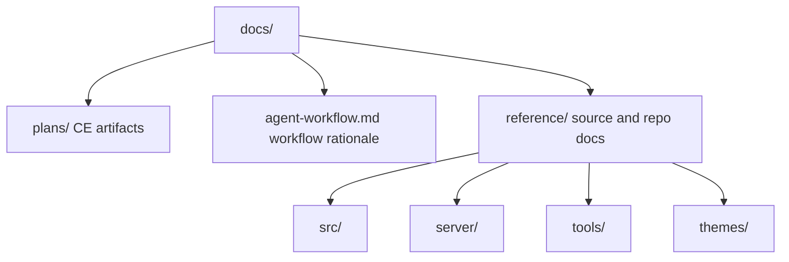

# Documentation Reference Layout Migration - Plan

## Goal Capsule

| Field | Plan |
|---|---|
| Objective | Consolidate repository documentation under `docs/` while keeping CE artifacts separate from source-mirror reference docs. |
| Product authority | User direction in this session: leave CE folders as-is and move exact file/detail documentation into a clearer non-CE namespace. |
| Execution profile | Docs and path-migration change affecting documentation layout, agent policy, and repo-local references. |
| Stop conditions | Stop if the migration mixes CE plans into source-reference docs, drops existing documentation, or leaves stale `documentation/` references in active docs. |
| Tail ownership | The implementing agent performs the file moves, updates references, and verifies no stale paths remain. |

---

## Product Contract

### Summary

The repository should use one top-level `docs/` root without making CE plans and exact source documentation look like the same kind of artifact. Keep `docs/plans/` for CE artifacts and move the current `documentation/` tree into `docs/reference/` for durable source, subsystem, and repo-reference material.

### Problem Frame

The current layout has both `docs/` and `documentation/`, which creates avoidable naming friction. The new CE workflow naturally uses `docs/plans/`, but the repository also has a large source-mirror documentation tree that should stay distinct from CE artifacts. A single `docs/` root with explicit subfolders gives a cleaner structure without erasing existing documentation.

### Requirements

**Folder Ownership**

- R1. `docs/plans/` must remain the CE artifact home.
- R2. Existing source-mirror and repo-reference docs must move from `documentation/` to `docs/reference/`.
- R3. `docs/reference/` must own the exact per-file and subsystem documentation for the whole extension/repo surface, including root repo docs, `src`, `server`, `server/examples`, `tools`, `tools/fixtures`, and `themes`.
- R4. `docs/agent-workflow.md` must own the CE/repo workflow rationale and remain separate from both CE plans and source-reference docs.

**Preservation**

- R5. The migration must preserve all existing documentation content unless a specific stale reference must be updated for the new paths.
- R6. The migration must not convert CE plans into source-reference docs or copy source-reference docs into `docs/plans/`.
- R7. The old `documentation/` folder must be removed after its contents are moved and references updated.

**Policy and References**

- R8. `AGENTS.md` must define `docs/` as the documentation root, `docs/plans/` as CE artifacts, and `docs/reference/` as source-mirror reference documentation.
- R9. Path examples in `AGENTS.md` must change from `documentation/...` to `docs/reference/...`.
- R10. Existing docs must be scanned for stale `documentation/` references and updated when they refer to the moved documentation tree.

### Scope Boundaries

- In scope: file moves from `documentation/**` to `docs/reference/**`, moving `documentation/agent-workflow.md` to `docs/agent-workflow.md`, updating `AGENTS.md`, and updating stale documentation-path references.
- In scope: preserving every existing documentation file under the new layout.
- Out of scope: changing TypeScript, Rust, package metadata, extension behavior, Reforger language logic, generated reports, or CE plan contents except for this new plan artifact.
- Out of scope: renaming `docs/plans/` or changing CE artifact conventions.
- Out of scope: rewriting historical CE plan artifacts to update old path references.

### Acceptance Examples

- AE1. Given a future agent needs source context for `src/extension.ts`, when it reads `AGENTS.md`, then it looks for `docs/reference/src/extension.md`.
- AE2. Given a future agent needs source context for `server/src/parser.rs`, when it reads `AGENTS.md`, then it looks for `docs/reference/server/src/parser.md`.
- AE3. Given a future agent creates a CE plan, when it chooses an artifact location, then it writes under `docs/plans/` and not under `docs/reference/`.
- AE4. Given a stale-reference search outside `docs/plans/` after migration, when the command finishes, then no active documentation-policy or path-reference hits remain.

---

## Planning Contract

### Key Technical Decisions

- KTD1. Use `docs/reference/` for exact source and repo-reference documentation. `reference` is explicit enough for per-file lookup material and separates it from CE workflow artifacts.
- KTD2. Keep `docs/plans/` unchanged. CE tooling already expects plan artifacts there, and the user explicitly wants CE folders left as-is.
- KTD3. Move `documentation/agent-workflow.md` to `docs/agent-workflow.md`, not `docs/reference/agent-workflow.md`. It explains workflow and document ownership rather than mirroring a source file.
- KTD4. Use Git-aware moves or equivalent file-preserving moves. The implementation should preserve file contents and history as much as the VCS can track through rename detection.
- KTD5. Treat this as a docs-only path migration. Verification is path/reference integrity plus whitespace checks unless implementation touches source, package, build, or runtime behavior.

### High-Level Technical Design

### Migration Map

| Current Path | New Path |
|---|---|
| `documentation/agent-workflow.md` | `docs/agent-workflow.md` |
| `documentation/package.md` | `docs/reference/package.md` |
| `documentation/language-configuration.md` | `docs/reference/language-configuration.md` |
| `documentation/server.md` | `docs/reference/server.md` |
| `documentation/src/**` | `docs/reference/src/**` |
| `documentation/server/**` | `docs/reference/server/**` |
| `documentation/tools/**` | `docs/reference/tools/**` |
| `documentation/themes/**` | `docs/reference/themes/**` |
| `docs/plans/**` | unchanged |

### System-Wide Impact

This migration changes agent lookup paths and any documentation references that point at the old `documentation/` tree. It does not change runtime behavior, but it affects future source-edit workflows because matching docs move from `documentation/<path>.md` to `docs/reference/<path>.md`.

### Assumptions

- The current uncommitted AGENTS/CE workflow refactor remains part of the working tree and should be updated in place rather than reverted.
- `docs/plans/` already exists because CE plan artifacts are now being created there.
- The pre-migration `documentation/` tree currently contains 85 files.
- The pre-migration `docs/plans/` tree currently contains 2 CE plan files.
- No external tooling in the repo currently depends on the literal `documentation/` path; this must be verified by search outside historical CE plan artifacts before finishing.

---

## Implementation Units

### U1. Move Documentation Tree

- **Goal:** Move all existing source and repo-reference documentation into `docs/reference/` while keeping CE plan artifacts in `docs/plans/`.
- **Requirements:** R1, R2, R3, R5, R6, R7
- **Files:** `documentation/**`, `docs/reference/**`, `docs/agent-workflow.md`; `docs/plans/**` is read-only verification scope.
- **Approach:** Move `documentation/agent-workflow.md` to `docs/agent-workflow.md`. Move every other file and folder under `documentation/` to the matching path under `docs/reference/`. Remove the empty `documentation/` tree after the move.
- **Test Scenarios:** Confirm 85 pre-migration `documentation/` files are accounted for after the move; confirm `docs/plans/` remains unchanged except for plan artifacts.
- **Verification:** Capture sorted `documentation/**` before the move; transform `documentation/agent-workflow.md` to `docs/agent-workflow.md` and every other `documentation/` prefix to `docs/reference/`; compare that expected list against post-move files.

### U2. Update Agent Policy Paths

- **Goal:** Update active policy so future agents use the new documentation root.
- **Requirements:** R8, R9
- **Files:** `AGENTS.md`
- **Approach:** Replace `documentation/` as the canonical source-mirror root with `docs/reference/`. Update examples such as `src/extension.ts` mapping to `docs/reference/src/extension.md`. Keep `docs/plans/` as CE artifact storage and `docs/agent-workflow.md` as workflow rationale.
- **Test Scenarios:** A future source edit routes to `docs/reference/...`; a future CE plan routes to `docs/plans/...`; workflow rationale routes to `docs/agent-workflow.md`.
- **Verification:** Manual read-through plus `rg -n "documentation/" AGENTS.md`.

### U3. Update Internal Documentation References

- **Goal:** Remove stale references to the old `documentation/` path from docs and repository text.
- **Requirements:** R10
- **Files:** `docs/reference/**`, `docs/agent-workflow.md`, `README.md`, `package.json`, and any other files with `documentation/` references.
- **Approach:** Search the repo for `documentation/`. Update references that point to moved documentation paths. Do not rewrite unrelated historical prose unless it would misdirect future agents or users.
- **Test Scenarios:** A stale-reference search outside historical CE plans has no active stale path references after migration.
- **Verification:** `rg -n "documentation/" . -g "!node_modules/**" -g "!dist/**" -g "!docs/plans/**"`.

### U4. Validate Layout and Preservation

- **Goal:** Verify the migration preserved documentation and kept CE artifacts separate.
- **Requirements:** R1, R2, R3, R5, R6, R7, R10
- **Files:** `docs/**`, `AGENTS.md`
- **Approach:** Compare a generated expected post-move manifest against actual files: old source-reference docs should now live under `docs/reference/`, workflow rationale under `docs/agent-workflow.md`, and CE artifacts under `docs/plans/`. Run whitespace and ASCII checks for changed markdown.
- **Test Scenarios:** Route sample tasks for `src/extension.ts`, `server/src/parser.rs`, CE plan creation, and stale-doc cleanup through the new layout.
- **Verification:** `git diff --check`; `rg --files docs`; expected-vs-actual moved-file manifest comparison; `rg -n "documentation/" . -g "!node_modules/**" -g "!dist/**" -g "!docs/plans/**"`; manual route simulation.

---

## Verification Contract

| Check | Applies To | Done Signal |
|---|---|---|
| Expected-vs-actual moved-file manifest comparison | U1, U4 | All 85 pre-migration `documentation/` files map to `docs/agent-workflow.md` or `docs/reference/**`. |
| `rg --files documentation docs` | U1, U4 | No files remain under `documentation/`; docs are present under `docs/`. |
| `rg -n "documentation/" . -g "!node_modules/**" -g "!dist/**" -g "!docs/plans/**"` | U2, U3, U4 | No active stale references to the old documentation root remain outside historical CE plan artifacts. |
| `git diff --check` | U1-U4 | No whitespace or patch formatting errors. |
| Manual route simulation | U2, U4 | Source docs route to `docs/reference/`; CE artifacts route to `docs/plans/`; workflow rationale routes to `docs/agent-workflow.md`. |
| File preservation review | U1, U4 | Every pre-migration documentation file is accounted for in the new layout. |
| `npm run check-types` | Only if source or package files change | TypeScript remains valid. |
| `npm run lint` | Only if source files change | ESLint passes for `src`. |
| `npm run compile` | Only if source, package, or build files change | Extension compile remains valid. |

---

## Definition of Done

- `documentation/` is gone or empty.
- `docs/reference/` contains the existing source-mirror and repo-reference docs.
- `docs/plans/` remains the CE artifact home.
- `docs/agent-workflow.md` owns workflow rationale.
- `AGENTS.md` uses `docs/reference/` and `docs/agent-workflow.md` for documentation policy and examples.
- No stale active `documentation/` references remain outside historical CE plan artifacts.
- The migration passes the docs-only verification contract, or any skipped check is explicitly justified.
