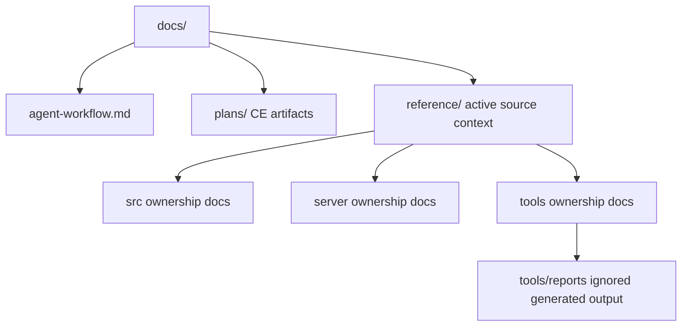

# Documentation Context Diet - Plan

## Goal Capsule

| Field | Plan |
|---|---|
| Objective | Keep repo-local documentation that CE cannot replace, while keeping generated report output separate from active source-reference pages. |
| Product authority | User direction in this session: decide whether `docs/reference/` is still needed, avoid context bloat, and keep CE folders separate. |
| Execution profile | Docs and policy cleanup affecting `AGENTS.md`, `docs/agent-workflow.md`, and documentation layout under `docs/`. |
| Stop conditions | Stop if useful repository knowledge is deleted without replacement, CE plan folders are renamed, or active source-edit workflows lose required context. |
| Tail ownership | The implementing agent audits, moves, rewrites, or deletes docs according to evidence; verification proves references and routing remain coherent. |

---

## Product Contract

### Summary

Keep `docs/reference/` as the active home for repository-specific source and subsystem context, because CE owns workflow artifacts but does not know this project's architecture, Reforger evidence model, or file ownership rules.
Reduce context bloat by separating generated report output from the source-owner pages that document report generators, tightening when agents must read reference docs, and deleting or rewriting stale docs only when evidence shows they no longer help.

### Problem Frame

The current layout correctly separates CE plans from repo reference docs, but report-named source-owner pages can be mistaken for generated output.
If that distinction is not explicit, future agents may move pages that document real report generators, or over-read ignored report output as current policy.
The fix is not to remove repo-local docs entirely.
The fix is to make the documentation tiers honest: active reference context stays small and authoritative, generated output remains under ignored `tools/reports/`, and obsolete material is rewritten or deleted through an evidence gate.

### Requirements

**Documentation Ownership**

- R1. `docs/reference/` must remain for active source, subsystem, and repo ownership context that CE cannot infer from its plugin workflow.
- R2. `docs/plans/` must remain the CE artifact home and must not receive source-reference docs or generated reports.
- R3. `docs/agent-workflow.md` must explain the relationship between CE workflow, active reference docs, reports, and deletion/rewrite evidence.
- R4. Generated reports, corpus reports, debug reports, baselines, and other output-style artifacts must not live in the active source-reference path; pages that document their source generators remain active reference context.

**Context Diet**

- R5. Agents must not be required to read broad or generated documentation just because it exists.
- R6. `AGENTS.md` must route agents to matching reference docs when they are relevant to the source change, and must distinguish active reference docs from report artifacts.
- R7. Per-file docs should be required for non-trivial or architecture-sensitive files, not for trivial metadata, generated output, or files where the source is clearer than a stale doc.
- R8. Stale, harmful, or duplicative docs may be rewritten, moved, or deleted when grounded in current source behavior, accepted policy, explicit user direction, or a current settled CE artifact.

**Preservation and Discoverability**

- R9. Existing information must be preserved by move or rewrite unless an evidence-backed decision says no replacement context is needed.
- R10. Generated report output must remain under ignored `tools/reports/` or another explicitly ignored output path; active documentation for the generator remains under `docs/reference/`.
- R11. Active docs and policy must avoid stale references to moved or deleted documentation paths.
- R12. The cleanup must not change TypeScript, Rust, extension runtime behavior, package behavior, Reforger language behavior, or CE plugin folders.

### Scope Boundaries

- In scope: auditing `docs/reference/**`, classifying docs by active reference versus generated output versus obsolete material, confirming the `tools/reports/` output boundary, updating `AGENTS.md`, updating `docs/agent-workflow.md`, and updating stale internal links.
- In scope: deleting or rewriting docs only when the evidence gate is satisfied and the useful context is preserved elsewhere or explicitly not needed.
- Out of scope: editing source code, changing extension behavior, changing package runtime metadata, renaming `docs/plans/`, rewriting historical CE plans, or changing CE plugin files.
- Out of scope: validating new Reforger language facts. If the cleanup touches language-behavior claims, the `reforger` skill and source-backed evidence model apply.

### Acceptance Examples

- AE1. Given an agent changes `src/languageClient/languageClient.ts`, when it needs ownership context, then it reads `docs/reference/src/languageClient/languageClient.md` if that file remains active and relevant.
- AE2. Given an agent investigates old parser corpus output, when it needs generator ownership context, then it reads the matching page under `docs/reference/`; generated run output remains under ignored `tools/reports/`.
- AE3. Given a future CE plan is created, when the artifact is written, then it remains under `docs/plans/` and is not copied into `docs/reference/`.
- AE4. Given a stale reference doc says to preserve an obsolete architecture, when current source and policy contradict it, then the doc is rewritten or deleted with replacement context preserved where useful.
- AE5. Given an agent performs a small metadata-only edit, when it checks policy, then it is not forced to create a low-value mirror doc.

---

## Planning Contract

### Key Technical Decisions

- KTD1. Keep `docs/reference/` for active repository context. CE is a process layer; it cannot replace project-specific source ownership, Reforger evidence rules, or architectural boundaries.
- KTD2. Keep generated reports, corpus reports, baselines, and debug output under ignored `tools/reports/`. Do not create a second tracked documentation tier for output that is already correctly excluded from source context.
- KTD3. Tighten `AGENTS.md` from "read every matching doc as ritual" toward "read matching active reference docs when they exist and are relevant to the file or subsystem being changed." The policy still prevents blind edits but reduces context bloat.
- KTD4. Preserve information by default through moves and focused rewrites. Delete only when the useful context is obsolete, duplicative, or harmful and the evidence gate is recorded in the change.
- KTD5. Keep CE artifacts immutable as planning history. Do not rewrite historical plans just to remove old path examples unless a current plan is the artifact being actively revised.

### High-Level Technical Design

### Initial Classification Rules

| Content shape | Target |
|---|---|
| Source/folder ownership, boundaries, behavior to preserve, future direction | `docs/reference/**` |
| Generated report, corpus report, debug output, baseline output, investigation transcript | Ignored `tools/reports/**` or another explicitly ignored output path |
| CE brainstorm, plan, review, or execution artifact | `docs/plans/**` |
| Stable project vocabulary introduced by CE compound workflows | Future `CONCEPTS.md`, not created by this plan |
| Obsolete or harmful legacy direction with no remaining useful context | Delete after evidence gate |

### Current Repo Signals

- `docs/reference/` currently has 84 files.
- `docs/reference/server/examples/` currently has 37 report-named pages that document matching report-generator source files and must remain active reference context.
- `docs/reference/server/src/` currently has 29 source-adjacent docs and is likely active reference context.
- `AGENTS.md` currently routes non-trivial or architecture-sensitive source changes to relevant active reference pages, while exempting trivial metadata, generated output, dependency artifacts, and formatting-only mechanical edits from ritual reads.

### Assumptions

- The previous documentation-root migration remains in the working tree and should be updated in place rather than reverted.
- `docs/reference/server/examples/**` files require per-file source-owner classification before any move; report-like names alone are not evidence of generated output.
- Generated output is already written to ignored `tools/reports/`; no tracked report migration is assumed.
- Some active reference docs may be stale; stale content should be rewritten or deleted only after reading the affected doc and checking current source or accepted policy.

---

## Implementation Units

### U1. Inventory and Classify Documentation

- **Goal:** Build a concrete inventory of active reference docs, report-style docs, and delete/rewrite candidates before moving anything.
- **Requirements:** R1, R4, R8, R9, R10
- **Files:** `docs/reference/**`, optional temporary manifest under `.git/` or another ignored scratch path.
- **Approach:** List all files under `docs/reference/`. Classify every file before any move, recording its old path, classification, source owner or evidence reason, and target/action. Representative reads calibrate the rule but never replace per-file classification.
- **Test Scenarios:** Report-style files are identified separately from active source ownership docs; no file is marked delete-only without a stated evidence reason.
- **Verification:** Produce a local manifest or terminal summary with counts for active reference, active subsystem design, generated-output, rewrite, and delete candidates.

### U2. Confirm the Generated-Output Boundary

- **Goal:** Keep generated output separate from the active source-reference read path without moving source-owner pages by filename.
- **Requirements:** R4, R5, R9, R10, R11
- **Files:** `docs/reference/server/examples/**`, `tools/reports/**`, `.gitignore`.
- **Approach:** Confirm that report-named reference pages document matching source generators and that generated run output belongs under ignored `tools/reports/`. Move a page only when its per-file classification proves it is output rather than source-owner context.
- **Test Scenarios:** Parser/index/LSP report-generator pages remain under `docs/reference/`; generated run output remains under ignored `tools/reports/`.
- **Verification:** Compare the per-file manifest with source paths and confirm `tools/reports/` is ignored.

### U3. Prune or Rewrite Stale Active Reference Docs

- **Goal:** Reduce stale context bloat without losing important architecture memory.
- **Requirements:** R1, R7, R8, R9
- **Files:** `docs/reference/**` after U2.
- **Approach:** Handle only high-confidence rewrite or delete candidates from U1. For each candidate, read the matching source file or folder context and decide whether the doc still provides useful ownership context. Leave ambiguous candidates in place with a follow-up note; delete only when the source is trivial, the doc duplicates source comments, or the content is obsolete/harmful and no replacement is needed.
- **Test Scenarios:** Non-trivial source folders still have active ownership context; trivial or misleading docs no longer force agent reads.
- **Verification:** Manual review of each deleted or heavily rewritten doc with an evidence note in the implementation summary.

### U4. Tighten Agent Documentation Policy

- **Goal:** Make policy reduce context bloat while preserving mandatory grounding for meaningful changes.
- **Requirements:** R3, R5, R6, R7, R8, R12
- **Files:** `AGENTS.md`, `docs/agent-workflow.md`.
- **Approach:** Update `AGENTS.md` to define `docs/reference/` as active source context and ignored `tools/reports/` as generated output. Add a decision table defining mandatory, optional, and exempt reads. Update `docs/agent-workflow.md` with the rationale and the evidence gate for moving/deleting docs.
- **Test Scenarios:** A parser change still routes through Reforger grounding and active reference docs; a corpus-report investigation routes to its source-owner page and generated output under `tools/reports/`; a trivial metadata-only edit does not create a mirror doc.
- **Verification:** Manual policy read-through plus targeted `rg` checks for `docs/reference`, `tools/reports`, and stale `documentation/` references.

### U5. Update Links and Verify Layout

- **Goal:** Finish with coherent paths and no stale active references.
- **Requirements:** R2, R3, R6, R10, R11, R12
- **Files:** `docs/**`, `AGENTS.md`, repository docs with moved-path references.
- **Approach:** Search for old paths and update active policy/reference links. Do not rewrite historical CE plan artifacts unless they are the current artifact being edited. Confirm `docs/plans/**` remains CE-only.
- **Test Scenarios:** Active docs point at `docs/reference/` for source ownership and `tools/reports/` for generated output; CE artifacts remain in `docs/plans/`.
- **Verification:** `rg -n "documentation/|docs/reference/server/examples|tools/reports" . -g "!node_modules/**" -g "!dist/**" -g "!.git/**"` with expected hits reviewed; `git diff --check`.

---

## Verification Contract

| Check | Applies To | Done Signal |
|---|---|---|
| Documentation classification manifest or summary | U1 | Every `docs/reference/**` file is classified as active reference, active subsystem design, generated-output, rewrite, or delete candidate. |
| Per-file classification manifest | U1, U2 | Every `docs/reference/**` file has a classification, source-owner/evidence reason, and target/action before any move. |
| Generated-output boundary check | U2 | Report-generator pages map to source owners and `tools/reports/` is ignored. |
| Evidence notes for deletion or major rewrite | U3 | Each deleted or heavily rewritten doc has a source/policy/user-direction reason; ambiguous candidates remain for follow-up. |
| `rg --files docs/reference docs/plans` | U2, U5 | Active reference and CE artifacts are visibly separated. |
| `rg -n "documentation/" . -g "!node_modules/**" -g "!dist/**" -g "!.git/**" -g "!docs/plans/**"` | U4, U5 | No stale active references remain. |
| `git diff --check` | U1-U5 | No whitespace or patch formatting errors. |
| Manual route simulation | U4, U5 | Parser/source changes route to active reference docs; report investigation routes to `tools/reports/`; CE plans route to `docs/plans/`. |
| `npm run check-types` | Only if source or package behavior changes | TypeScript remains valid. |
| `npm run lint` | Only if source files change | ESLint passes for `src`. |
| `npm run compile` | Only if source, package, or build files change | Extension compile remains valid. |

---

## Definition of Done

- Confirmed report-generator owner pages remain under `docs/reference/`; every changed or removed reference page has recorded evidence for its classification and destination.
- Generated reports, corpus reports, baselines, and debug output remain under ignored `tools/reports/`.
- Confirmed low-value or harmful docs are rewritten or deleted only with an evidence-backed reason; ambiguous docs are recorded for follow-up rather than removed.
- `docs/plans/` remains CE-only.
- `AGENTS.md` reduces context bloat by requiring relevant active reference docs, not broad generated report reads.
- `docs/agent-workflow.md` explains why CE does not replace repo-local reference docs and how reports differ from active context.
- No stale active links point at old documentation locations or moved report paths.
- Docs-only verification passes, or any skipped check is explicitly justified.
