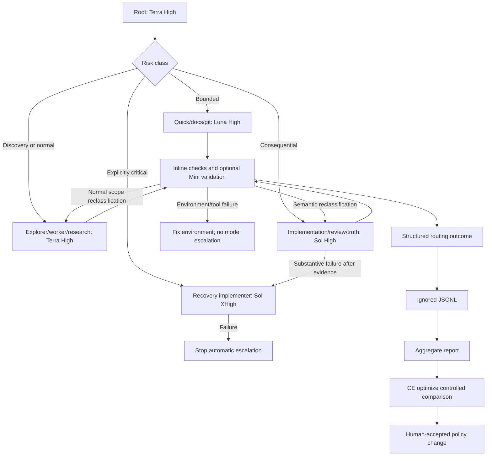

# Cost-Aware Codex Agent Routing - Plan

## Goal Capsule

| Field | Plan |
| --- | --- |
| Objective | Add project-local Codex agents and a lightweight evaluation loop that maximize completed-work quality per unit of model usage, while spending more automatically when failure or missed intent would be materially expensive. |
| Product authority | User-approved balanced-premium posture: Terra High is the everyday default, Luna High owns strictly bounded work, Sol High owns consequential work, Sol XHigh is a controlled critical/recovery route, and GPT-5.4 Mini Low owns deterministic independent validation. |
| Execution profile | Codex configuration, agent prompts, contributor policy, CE workflow guidance, and dev-only observation tooling. No extension or language-server runtime changes. |
| Stop conditions | Stop if implementation requires modifying the installed Compound Engineering plugin, recording prompt or source content in observations, silently substituting unavailable models, or claiming a CE-internal route that Codex cannot verify. |
| Tail ownership | Implementation configures and smoke-tests the project agents, validates observation tooling, updates matching policy/rationale docs, and records surface-specific limitations. |

---

## Product Contract

### Summary

Create a balanced-premium project fleet. Use GPT-5.6 Terra High for normal orchestration, discovery, and behavior-bearing implementation; GPT-5.6 Luna High for narrow, easily verified work; GPT-5.6 Sol High for consequential implementation and review; and Sol XHigh for one controlled recovery or explicitly critical work. Keep GPT-5.4 Mini Low as a command-focused independent validator.

Treat DeepSWE v1.1 as a strong prior for long-horizon implementation, not as a universal ranking for every agent responsibility. Its tasks are original, underspecified, and average roughly seven files and 668 added lines, but it uses a model-neutral harness and under-represents bug localization and refactoring. Local routing outcomes must determine whether these defaults transfer to this repository and native Codex workflows.

### Problem Frame

The repository currently has no project-local Codex configuration or custom agents, so model choice is inherited or selected ad hoc. The earlier Luna-first proposal minimized per-attempt cost but underweighted failure and correction costs: on DeepSWE, Luna Medium and Low completed only 11% and 2% of long-horizon tasks, while Terra High reached 54% and Sol High reached 69%.

The opposite extreme, routine Sol XHigh or Max, is also unjustified. Sol High is the practical premium elbow at 69% for $3.47 average benchmark cost; XHigh adds about two percentage points for $1.23 more, while Max adds about four points for $4.92 more. The fleet therefore needs explicit risk classes rather than one cheap model or one premium model everywhere.

Compound Engineering already separates extraction, generation, and ceiling work semantically, but some CE skills own their own generic reviewers and model tiers. Project routing must guide compatible dispatches without editing plugin cache files or falsely claiming control of CE internals.

### Requirements

**Routing and cost control**

- R1. Project-local Codex configuration must make Terra High the normal root/default route while preserving explicit per-run user overrides.
- R2. The fleet must use Luna High only for strictly bounded, easily inspected work; Terra High for normal discovery, implementation, and evidence synthesis; and Sol High for consequential implementation, review, or truth evaluation.
- R3. Focused independent test, build, lint, and type-check execution must use GPT-5.4 Mini Low; it must report exact outcomes without diagnosing failures or editing source.
- R4. Sol XHigh may run automatically only for work classified as explicitly critical before dispatch or for one controlled recovery after a substantive Sol High failure. Sol Max is manual-only, and Ultra must never be selected automatically.
- R5. Luna Low/Medium/XHigh/Max, Terra Low/Medium/XHigh/Max, Sol Low/Medium/Max, GPT-5.5, and full GPT-5.4 must have no automatic project role until local evidence establishes a distinct responsibility.
- R6. Agent nesting and concurrency must remain bounded at one delegation level and four concurrent threads.
- R16. An unavailable configured model must fail visibly and be recorded as unavailable; required checks may run inline, but no route may silently substitute another agent model.

**Workflow integration**

- R7. Compatible CE workflows must use explicit project roles and the built-in `explorer` and `worker` overrides where supported.
- R8. CE skills that own generic reviewer personas or semantic model tiers must retain that authority; observations must classify those routes as inherited, CE-managed, or unverified.
- R9. Reforger evidence collection must invoke the `reforger` skill. Consequential language, API, replication, or Workbench conclusions must receive independent Sol High truth review without replacing Workbench/compiler authority.
- R10. Commit and push behavior must remain explicit-request-only regardless of model or workflow.
- R17. Every task must be classified before delegation as bounded, normal, consequential, or critical using observable scope and risk triggers; model escalation must follow the documented state machine rather than subjective model preference.

**Evaluation and adaptation**

- R11. Each completed delegated task must return a compact routing outcome containing workflow, role, task/risk class, requested and actual route, selection reason, verification result, corrections, escalation, availability, and failure categories without prompt or source content.
- R12. Usage, latency, token, and reported-cost fields must be optional and recorded only when the Codex surface exposes trustworthy values; missing values must not be estimated.
- R13. Raw observations and generated reports must stay under ignored `tools/reports/`; only durable policy and proven lessons may enter tracked documentation.
- R14. The first routing review must occur after at least 30 completed delegations with at least five samples for each high-volume role; subsequent reviews occur every 50 additional tasks or after three similar failures within ten comparable tasks.
- R15. Routing changes must compare first-pass quality, correction burden, escalation, and completed-work cost before per-attempt price. Ambiguous evidence uses `ce-optimize`; accepted durable lessons use `ce-compound`.

### Scope Boundaries

- In scope: `.codex/config.toml`, project agents, deterministic routing rules, CE/Reforger policy, compact observations, aggregation/reporting tooling, focused tests, and matching docs.
- In scope: `explorer` and `worker` compatibility overrides plus dedicated high-risk and recovery agents for routes that cannot safely share the normal worker model.
- Out of scope: modifying Compound Engineering, forcing models inside CE-owned reviewer dispatch, user-level `~/.codex/config.toml`, OpenTelemetry, prompt/tool-output collection, and automated routing-policy rewrites.
- Out of scope: extension runtime behavior, TypeScript features, Rust language behavior, marketplace packaging, and credit purchasing.

### Acceptance Examples

- AE1. Repository discovery uses Terra High `explorer` and returns read-only decision-ready findings plus a routing outcome.
- AE2. A clear one- or two-file change with no public-contract, uncertain API, or semantic-core impact uses Luna High `quick-implementer`.
- AE3. Normal behavior-bearing TypeScript or Rust work uses Terra High `worker`; parser/model/index/LSP semantic work routes directly to Sol High `high-risk-implementer`.
- AE4. A substantive Sol High failure may receive one Sol XHigh `recovery-implementer` attempt; an XHigh failure stops automatic escalation.
- AE5. GPT-5.4 Mini Low executes specified checks independently, changes no source, and returns failures to the owning implementer or debugger.
- AE6. A CE-owned generic reviewer is recorded as CE-managed or unverified and does not automatically receive a duplicate project Sol reviewer.
- AE7. Reforger research uses Terra High plus the `reforger` skill; consequential conclusions receive Sol High review while Workbench/compiler remains final authority.
- AE8. An unavailable route fails visibly and is recorded without an undisclosed fallback.
- AE9. Reports group outcomes by role, model, effort, task class, and risk class, flag insufficient samples, and never mutate routing configuration.

---

## Planning Contract

### Key Technical Decisions

- KTD1. Use a balanced-premium fleet: Terra High by default, Luna High for bounded work, Sol High for consequential work, Sol XHigh for controlled critical/recovery work, and Mini Low for deterministic validation. (session-settled: user-approved - chosen over the earlier Luna-first fleet: benchmark evidence shows that underpowered implementation routes can erase per-attempt savings through failure and correction.)
- KTD2. Give Terra High the everyday role. (session-settled: user-approved - chosen over Luna High and Sol Medium as the root/normal default: Terra is OpenAI's balanced tier and occupies the useful quality/cost middle in DeepSWE.)
- KTD3. Keep Sol Max manual-only and Ultra out of automatic routing. (session-settled: user-approved - chosen over automatic ceiling escalation: their marginal benchmark gains do not justify routine cost or fan-out.)
- KTD4. Override built-in `explorer` and `worker` names for CE compatibility, and add separate `high-risk-implementer` and `recovery-implementer` roles so premium routing remains explicit and measurable.
- KTD5. Retain narrow documentation and commit/push roles from the approved scope. Their instructions isolate ownership and safety; both use Luna High because they are bounded but still require enough judgment to avoid stale docs or incorrect staging.
- KTD6. Treat CE integration as bounded. CE-owned semantic tiers and generic reviewers remain CE-managed; project policy controls only named roles and inherited defaults.
- KTD7. Collect content-free outcomes continuously and review them periodically rather than performing a one-time audit or per-task human review.
- KTD8. Judge completed-work efficiency, not nominal cost per benchmark success. Simple ratios assume every failure is detected and retries are free, which is unsafe for orchestration, semantic work, and review.
- KTD9. Give each review question one owner: targeted `code-reviewer` or the applicable CE review workflow, never both automatically.
- KTD10. Use four concurrent threads and one delegation level initially; change either only through a measured routing review.
- KTD11. Do not silently fall back or cascade models. Availability and classification failures are evidence and must remain observable.
- KTD12. Use DeepSWE as a versioned external prior and local observations as the repository-specific authority. Benchmark updates may prompt review but never rewrite routes directly.

### Routing State Machine



### Automatic Classification Rules

- **Bounded:** one or two files, established local pattern, clear acceptance behavior, no public contract, no uncertain API, no semantic core, and focused verification available.
- **Normal:** behavior-bearing work with understood architecture, normal rollback, and adequate tests; may span several files but does not change a semantic or cross-subsystem contract.
- **Consequential:** parser, AST, semantic model, index, diagnostics semantics, formatting semantics, LSP contracts, process lifecycle, packaging/runtime acquisition, security, data-loss risk, difficult rollback, weak verification, or exact Reforger behavior encoded into tooling.
- **Critical:** explicitly identified before dispatch as unusually expensive to get wrong, or a consequential Sol High task that failed substantively after receiving exact evidence and one correction opportunity.
- Tool failure, dependency failure, flaky tests, missing credentials, or unavailable models never raise the reasoning tier.

### Output Structure

```text
.codex/
  config.toml
  agents/
    explorer.toml
    quick-implementer.toml
    worker.toml
    high-risk-implementer.toml
    recovery-implementer.toml
    code-validator.toml
    code-reviewer.toml
    doc-maintainer.toml
    commit-pusher.toml
    reforger-researcher.toml
    reforger-reviewer.toml
tools/
  agent-routing-report.mjs
  agent-routing-report.test.mjs
docs/reference/tools/
  agent-routing-report.md
```

### Risks and Mitigations

- DeepSWE may overstate the needs of small native-Codex tasks. Mitigation: restrict its direct influence to implementation/judgment tiers and collect local role-specific outcomes.
- Cheap routes may miss intent while still passing narrow checks. Mitigation: strict bounded criteria, independent validation where useful, and first-pass/correction tracking.
- Premium routes may be overused through vague risk labels. Mitigation: require enumerated risk classes and selection reasons in every observation.
- Parallel agents may contend or inflate usage. Mitigation: depth one, four threads, disjoint ownership, and CE dependency rules.
- CE internal models may be unobservable. Mitigation: record route source and actual route separately; use `unverified` instead of guessing.
- Duplicate review wastes Sol and reviewer usage. Mitigation: one review owner per question.
- Observations may create privacy or context bloat. Mitigation: compact enums, no content or absolute paths, ignored raw files, threshold-triggered reports.
- Model identifiers, access, or pricing may change. Mitigation: centralize assignments in TOML, fail visibly, and treat external changes as review triggers.

---

## Implementation Units

### U1. Establish Balanced Project Defaults

- **Goal:** Configure Terra High as the trusted-project default with bounded delegation.
- **Requirements:** R1, R4-R6, R16, R17; KTD1-KTD3, KTD10-KTD12
- **Dependencies:** None
- **Files:** `.codex/config.toml`
- **Approach:** Set Terra High as the project default, `agents.max_threads = 4`, and `agents.max_depth = 1`. Do not add user-level telemetry, credentials, provider, profile, or notification settings.
- **Verification:** Confirm trusted VS Code and CLI sessions load the default, direct user overrides still win, and a child cannot recursively delegate.

### U2. Define the Risk-Tiered Agent Fleet

- **Goal:** Create narrow agents with explicit models, effort, permissions, evidence requirements, and outcome contracts.
- **Requirements:** R2-R5, R7, R9-R12, R16-R17; AE1-AE8; KTD1-KTD5, KTD11
- **Dependencies:** U1
- **Files:** `.codex/agents/*.toml`
- **Approach:** Configure the routing matrix exactly. Keep explorer/reviewer roles read-only where compatible, validator source-read-only, writers evidence-driven, commit/push explicitly authorized, and both Reforger roles bound to the `reforger` skill and evidence hierarchy.
- **Test scenarios:** Load every role; verify bounded-task rejection, source-write boundaries, explicit git refusal, Reforger skill invocation, actual model/effort receipts where exposed, and visible unavailable-model failure.
- **Verification:** Run one minimal responsibility-specific smoke prompt per role and compare its behavior and routing outcome with the contract.

### U3. Encode Routing and CE Policy

- **Goal:** Make risk classification and CE integration durable without competing with plugin-owned dispatch.
- **Requirements:** R7-R10, R15, R17; AE1-AE8; KTD4-KTD6, KTD9, KTD12
- **Dependencies:** U1, U2
- **Files:** `AGENTS.md`, `docs/agent-workflow.md`
- **Approach:** Add concise active policy to `AGENTS.md`; place rationale, DeepSWE interpretation, classification examples, escalation rules, CE mapping, and review thresholds in the linked workflow doc. Map normal CE work to Terra `worker`, explicitly consequential units to Sol `high-risk-implementer`, deterministic independent checks to Mini, and accepted learnings to `ce-compound`. Preserve CE-owned reviewer authority.
- **Test scenarios:** Simulate CE brainstorm, plan, work, debug, review, compound, commit/push, and Reforger tasks; confirm one review owner and correct route-source attribution.
- **Verification:** Manually classify representative repository tasks and confirm all agents reach the same route from the documented rules.

### U4. Add Outcome Recording and Reporting

- **Goal:** Measure repository-specific completed-work quality and cost without runtime dependencies or tracked report noise.
- **Requirements:** R11-R16; AE9; KTD7-KTD8, KTD11-KTD12
- **Dependencies:** U2, U3
- **Files:** `tools/agent-routing-report.mjs`, `tools/agent-routing-report.test.mjs`, `docs/reference/tools/agent-routing-report.md`
- **Approach:** Build a Node-built-in-only record/report tool. The parent serially validates and appends returned outcomes under ignored `tools/reports/agent-routing/`; subagents never write shared JSONL. Aggregate first-pass success, correction, escalation, verification failure, availability, and failure-tag rates by workflow, role, route source, model/effort, task class, and risk class. Reject content-bearing fields and make all usage fields optional.
- **Test scenarios:** Cover valid aggregation, serial records, malformed input, missing usage, prohibited content/paths, unavailable routes, insufficient samples, repeated-failure triggers, and separation of CE-managed from named routes.
- **Verification:** Run the focused Node tests, generate a representative report, and confirm all output remains ignored.

### U5. Validate the Feedback Loop

- **Goal:** Prove classification, delegation, validation, escalation, observation, and policy review form one coherent workflow.
- **Requirements:** R1-R17; AE1-AE9; KTD1-KTD12
- **Dependencies:** U1-U4
- **Files:** `.codex/**`, `AGENTS.md`, `docs/agent-workflow.md`, routing report tooling and docs
- **Approach:** Exercise bounded, normal, consequential, critical/recovery, Reforger, validation, CE-managed review, and unavailable-model scenarios. Confirm no route silently cascades and no report changes configuration.
- **Test scenarios:** Luna expands to Terra on discovered scope; Terra reclassifies to Sol on semantic risk; Sol receives at most one XHigh recovery; XHigh failure stops; CE review prevents duplicate project review; Reforger truth remains subordinate to Workbench.
- **Verification:** Review the generated sample report, smoke-test all routes, run docs/path checks, and record any surface that cannot expose actual model receipts.

---

## Verification Contract

| Check | Applies To | Done Signal |
| --- | --- | --- |
| Project config smoke test in VS Code and CLI | U1, U2, U5 | Terra High default, explicit overrides, depth one, and four-thread cap are observed. |
| Agent load and boundary matrix | U2, U5 | All roles load with expected model/effort and respect read/write/evidence/git boundaries. |
| Classification scenario matrix | U3, U5 | Bounded, normal, consequential, and critical examples route deterministically. |
| CE workflow simulation | U3, U5 | Compatible roles are used without overriding or duplicating CE-owned reviewers. |
| Reforger evidence simulation | U2, U3, U5 | Skill invocation, evidence authority, independent review, and Workbench precedence are preserved. |
| Focused Node report tests | U4, U5 | Schema, aggregation, privacy, thresholds, unavailable routes, and optional usage pass. |
| `git check-ignore tools/reports/agent-routing/sample.jsonl` | U4, U5 | Raw observations and reports are ignored. |
| `git diff --check` | U1-U5 | No whitespace or patch-format errors. |
| Active-path review | U3, U5 | Policy links use `.codex/agents/`, `docs/reference/`, and ignored `tools/reports/` paths. |
| Repository build checks | Only if implementation unexpectedly affects source/package behavior | Existing TypeScript/Rust build and tests remain valid. |

---

## Definition of Done

- Trusted project sessions default to Terra High with one delegation level and four concurrent threads.
- Luna High owns only bounded quick, documentation, and explicit git work.
- Terra High owns normal orchestration, exploration, implementation, and Reforger evidence research.
- Sol High owns consequential implementation, project review, and Reforger truth review.
- Sol XHigh owns only explicitly critical work or one controlled recovery after Sol High failure.
- Sol Max remains manual-only; Ultra and all unassigned model/effort combinations have no automatic route.
- GPT-5.4 Mini Low validates specified commands independently without diagnosing or editing.
- CE-owned model tiers and reviewer personas remain intact, distinguishable, and non-duplicated.
- Every delegated task returns a content-free routing outcome; the parent records outcomes serially under ignored output.
- Reports measure completed-work outcomes, flag insufficient evidence, and never alter routing automatically.
- `ce-optimize` owns controlled comparisons and `ce-compound` captures only accepted durable lessons.
- Policy, rationale, smoke tests, classification scenarios, report tests, ignored-output checks, and docs validation pass or limitations are recorded.

---

## Sources and Research

- OpenAI, "GPT-5.6: Frontier intelligence that scales with your ambition" (2026-07-09): Sol is the flagship, Terra is balanced everyday work, Luna is the fastest/most affordable tier, and Max/Ultra provide higher-cost capability. <https://openai.com/index/gpt-5-6/>
- DataCurve, DeepSWE v1.1 leaderboard (updated 2026-07-17): long-horizon Pass@1, average cost, output-token, and step measurements across GPT-5.6 models and reasoning levels. <https://deepswe.datacurve.ai/>
- DataCurve, DeepSWE methodology and limitations: 113 original tasks across 91 repositories, model-neutral mini-swe-agent harness, behavioral verification, and limited representation of localization/refactoring. <https://deepswe.datacurve.ai/blog/deepswe>
- DataCurve, DeepSWE v1.1 revision: isolated verification and stability of aggregate ordering after benchmark corrections. <https://deepswe.datacurve.ai/blog/deepswe-v1-1>
- Three-agent model-selection think tank: Sol High quality-first, Terra High balanced, and Luna High cost-skeptical reviews. Consensus supported stronger normal routes than the original plan, no Sol Low quality gate, one review owner, visible availability failures, and no routine Max/Ultra use; disagreement was resolved by the user-selected balanced-premium posture.
- Compound Engineering 3.19.0 contracts: semantic extraction/generation/ceiling tiers, generic reviewer ownership, `ce-optimize` for measured comparisons, and `ce-compound` for durable accepted learnings.
- Repository pattern: `tools/lsp-runtime-performance-report.mjs` and its matching reference page keep dev-only measurement outside extension runtime and generated output under ignored `tools/reports/`.
