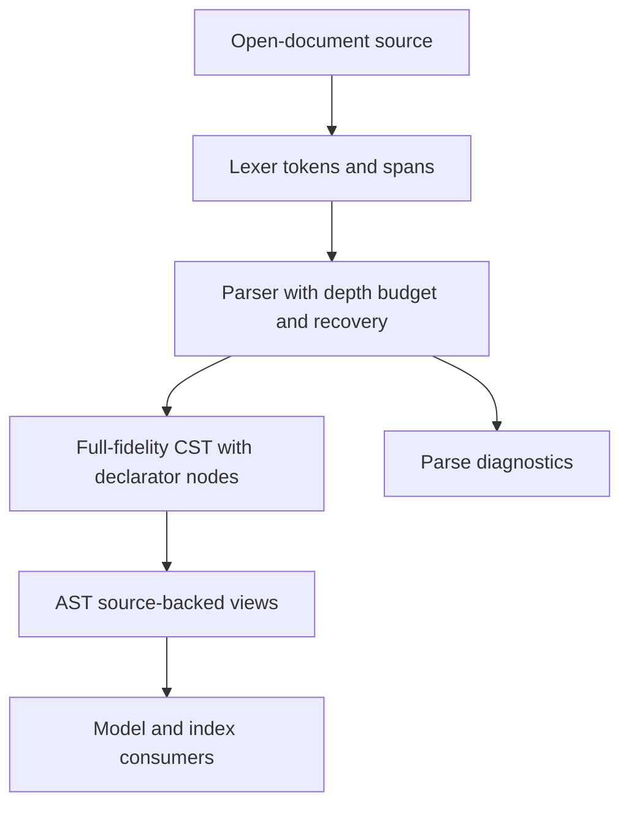

# Parser Resilience and CST Boundaries - Plan

## Goal Capsule

- **Objective:** Make the Rust Enfusion Script parser safe for malformed editor input, preserve line-oriented preprocessor recovery, and eliminate AST-side reimplementation of declaration segmentation.
- **Authority:** `AGENTS.md` architecture and Reforger truth policy govern boundaries; Workbench/compiler behavior remains language authority.
- **Execution profile:** Implement the units in dependency order, keep parsing syntax-only, and validate with focused Rust tests plus the existing server suite.
- **Stop conditions:** Stop for a design decision if declarator CST structure cannot represent current field/local forms without guessing semantic meaning, or if Workbench evidence contradicts an accepted line-ending/recovery behavior.
- **Tail ownership:** The implementer updates matching reference pages and records any remaining Workbench-validation uncertainty.

---

## Product Contract

### Summary

The new language-engine parser must remain available while users type incomplete source, produce useful diagnostics for malformed input, and expose one authoritative syntactic decomposition for declarations to AST/model consumers.

### Problem Frame

The review identified a process-availability risk from unbounded recursive parsing, two observable recovery gaps, and duplicated declaration grammar in `ast.rs`. The existing fixture report also leaves one committed parser fixture out of its human-review output.

### Requirements

**Parser resilience**

- R1. Parser recursion over expressions, initializer lists, nested blocks, and recursive CST consumers reachable from normal parse-to-LSP flow must be bounded so adversarially deep open-document input yields a diagnostic and recoverable syntax tree rather than terminating the language server.
- R2. A preprocessor directive must terminate at either supported physical line terminator without consuming declarations on later lines.
- R3. An unmatched top-level closing brace must produce a parse diagnostic while preserving the error token/node and continuing safely.

**Authoritative declaration structure**

- R4. The parser/CST must own syntactic declaration boundaries needed for fields, local declarations, declaration-form `for` initializers, and `foreach` variables, including shared modifiers/type text, comma-separated declarators, and initializer/default-expression spans or child nodes.
- R5. AST declaration and local-variable extraction must consume those CST boundaries rather than reclassifying declaration tokens, maintaining its source-backed public views and current model/index contracts.

**Review evidence and documentation**

- R6. The parser fixture report must include every committed parser fixture relevant to the report manifest, including `local_block_symbols.c`.
- R7. Reference documentation must describe the bounded-recovery and declarator-boundary behavior without overstating Workbench/compiler confirmation.

### Acceptance Examples

- AE1. Given balanced and unterminated documents with nesting beyond the configured parser budget followed by a sibling declaration, parsing returns a `SourceFile` with one bounded recovery region, a diagnostic, and preserved following declaration; the process remains alive for a subsequent normal parse and downstream AST/model/index projection.
- AE2. Given `#define FLAG 1\rclass Example {}` and its CRLF equivalent, the directive ends before `class Example` and the class remains represented in the tree.
- AE3. Given `}`, parsing returns an `Error` node and at least one diagnostic.
- AE4. Given fields and local declarations with shared types, comma declarators, generic/array shapes, and brace defaults, CST declarator nodes let AST expose the same names, modifiers, type spans, and default spans without token-depth rescanning.

### Scope Boundaries

- In scope: Rust lexer/parser/syntax/AST code, inline Rust tests, parser fixture-report manifest, and matching documentation.
- Deferred: semantic type inference, Workbench preprocessor evaluation, accepting unsupported source encodings, changing the lexer’s token model, or broad LSP architecture changes.
- Outside this plan: treating CR-only files as Workbench-supported Enfusion input before validation. The parser will be internally consistent; language acceptance remains Workbench-confirmed evidence.

---

## Planning Contract

### Key Technical Decisions

- KTD-1. Use one private parser depth budget shared by every recursive parser edge: class/block and control-flow bodies, parenthesized/prefix/binary/ternary/postfix/index/argument expressions, and initializer nesting. The counter measures nested parser-entry depth, not source-token count; its initial value is chosen from committed fixtures and rechecked against the available corpus when present.
- KTD-2. At budget exhaustion, create one Error recovery region, emit one diagnostic, and iteratively consume only until the current frame's stop token or EOF without consuming the parent-owned delimiter. Parent frames retain their matching closer and continue normal progress; tests must prove preservation of a following sibling declaration.
- KTD-3. Establish the declaration CST contract before AST migration: a field/local/declaration-form-for shape contains shared `ModifierList` and `TypeRef` syntax followed by a `DeclaratorList` of `Declarator` nodes. Each declarator owns its name, array suffix tokens, optional equals token, and parsed default/initializer expression; the list owns separators, declaration owns terminators and trivia, and malformed segments remain Error nodes rather than declarators.
- KTD-4. Keep `ForeachVariable` as a distinct parser-owned declaration shape because it has no initializer/default form. AST must consume its existing structured child syntax directly and remove token-slice recognition for typed, `auto`, and index/value foreach forms.
- KTD-5. Audit every recursive CST producer, consumer, and disposal-sensitive route reached by parser -> AST -> model -> index -> LSP. The selected parser budget must bound each route; convert any route not safely bounded by that tree depth to iterative traversal before claiming language-server availability.
- KTD-6. Treat CR and LF as parser physical-line terminators only for directive recovery. Do not evaluate directives or make broader preprocessor-language claims.
- KTD-7. Preserve full-fidelity tokens and source spans. Recovery/error nodes may contain consumed tokens, and the new structural nodes must not discard trivia or create a parallel token representation.
- KTD-8. Use focused unit tests for malformed/deep input, line endings, CST shape, and AST extraction; retain `cargo test` as the final non-overlapping Rust verification command.

### High-Level Technical Design

The parser remains the only owner of declaration segmentation. Its recovery budget applies at recursive entry boundaries and produces one bounded diagnostic/Error region without consuming a parent delimiter. AST reads direct declarator children for field/local/`for` facts and direct `ForeachVariable` structure for foreach facts, avoiding raw-source brace scans and duplicate delimiter/depth bookkeeping.

### Sequencing

U1 repairs directly observable recovery behavior and establishes the test style. U2 makes recursion bounded. U3 introduces declarator CST structure; U4 migrates AST and validates downstream facts against that structure. U5 completes report/documentation evidence after behavior is stable.

### Risks and Dependencies

- The depth budget must be high enough for real game data but finite for hostile editor input; choose and document a value backed by committed fixtures, then revisit only with corpus evidence.
- Declarator nodes must cover current parser recovery tolerance without presenting malformed syntax as semantically valid declarations.
- Workbench validation is required to establish whether CR-only files are supported language input; no source fixture or corpus report can establish that.

---

## Implementation Units

### U1. Repair line-boundary and unmatched-brace diagnostics

- **Goal:** Make the two localized parser recovery paths observable and internally consistent.
- **Requirements:** R2, R3, AE2, AE3.
- **Files:** `server/src/parser.rs`, `docs/reference/server/src/parser.md`.
- **Approach:** Centralize the parser’s physical-line-end predicate for directive scanning so it recognizes CR and LF consistently with lexer treatment. Route a top-level `RightBrace` through the existing diagnostic mechanism before preserving it in an `Error` node. Keep token preservation and declaration recovery unchanged otherwise.
- **Test Scenarios:** Parse CR-only and CRLF directives followed by a class and assert the class remains in the tree; parse `}` and assert one diagnostic plus an Error node; retain LF directive behavior.
- **Verification:** Run focused parser tests during implementation, then the U5 final Rust suite.

### U2. Bound recursive parser descent

- **Goal:** Prevent deeply nested but valid-looking editor input from exhausting the language-server process stack.
- **Requirements:** R1, AE1.
- **Files:** `server/src/parser.rs`, `docs/reference/server/src/parser.md`.
- **Dependencies:** U1.
- **Approach:** Add parser-owned recursion accounting at every KTD-1 recursive edge. At the configured ceiling, create one Error region, emit one diagnostic, and iteratively consume to the current frame's stop token or EOF without consuming the parent-owned delimiter. Audit recursive CST producers/consumers and recursive disposal-sensitive paths through AST/model/index/LSP; convert any path the parser budget does not bound to iteration. The limit is a private parser safeguard, not a setting or semantic language restriction.
- **Test Scenarios:** Balanced and unterminated deep parenthesized expressions, nested unary expressions, brace initializer lists, and nested blocks exceed the budget without aborting; each preserves a following sibling declaration; a normal parse and parse -> AST/model/index projection immediately afterward succeeds; ordinary committed parser fixtures stay diagnostic-free.
- **Verification:** Focused parser and downstream projection tests prove process survival, bounded diagnostics, cursor progress, and following-declaration preservation; `cargo test` proves repository-wide interactions.

### U3. Model field and local declarators in CST

- **Goal:** Move declaration segmentation from AST heuristics into the parser’s authoritative syntax tree.
- **Requirements:** R4, AE4.
- **Files:** `server/src/syntax.rs`, `server/src/parser.rs`, `docs/reference/server/src/syntax.md`, `docs/reference/server/src/parser.md`.
- **Dependencies:** U2.
- **Approach:** Implement KTD-3's normative child shape for fields, locals, and declaration-form `for` initializers. Reuse existing parsed expression/`InitializerExpression` children rather than duplicating expression parsing; preserve commas/terminators/trivia at their owning levels; retain malformed segments as Error syntax. Define the direct structured-child contract for `ForeachVariable` in the same parser-owned layer without forcing foreach into the initializer-bearing declarator shape.
- **Test Scenarios:** Fields and locals cover shared type/modifiers, comma declarators, static arrays, generic type arguments, direct brace defaults, calls containing brace lists, `for` initializer locals, typed/`auto`/index-value foreach variables, and malformed declarations that must not create false declarators.
- **Verification:** Parser tests assert both token preservation and direct child-node shape; current parser fixtures remain preserved.

### U4. Consume declarator CST nodes from AST

- **Goal:** Remove AST’s duplicate declaration grammar while retaining public source-backed facts used by model/index/resolver features.
- **Requirements:** R5, AE4.
- **Files:** `server/src/ast.rs`, `server/src/parser.rs`, `docs/reference/server/src/ast.md`.
- **Dependencies:** U3.
- **Approach:** Rework field, ordinary-local, and declaration-form-for extraction to iterate parser-produced declarator nodes and derive name/type/modifier/default spans from direct children. Rework foreach extraction to consume parser-owned `ForeachVariable` child structure. Delete superseded AST classification, token-depth scans, and raw-source brace recovery only after equivalent coverage passes. Keep existing AST view contracts intact.
- **Test Scenarios:** Existing AST/model/index tests retain field/local names and spans; fixtures prove locals in nested blocks and `for` headers plus typed/`auto`/index-value foreach forms; malformed declarations do not leak symbols; brace-default spans use parser expression nodes instead of raw source scanning.
- **Verification:** Run targeted AST/parser/model/index tests while iterating, then `cargo test` from `server/` once after the final implementation.

### U5. Complete fixture-report and documentation evidence

- **Goal:** Make the review artifact complete and document the final parser/AST ownership and validation boundaries.
- **Requirements:** R6, R7.
- **Files:** `server/examples/parser_report.rs`, `docs/reference/server/examples/parser_report.md`, `docs/reference/server/src/parser.md`, `docs/reference/server/src/ast.md`, `docs/reference/server/src/syntax.md`.
- **Dependencies:** U1, U2, U3, U4.
- **Approach:** Add `tools/fixtures/parser/local_block_symbols.c` to the parser-report manifest and adjust its fixed manifest shape. Regenerate/review the report according to existing tooling. Update references with the depth-budget behavior, declarator CST ownership, AST consumption path, tests, and Workbench-validation caveat; remove any stale description of AST token rescanning.
- **Test Scenarios:** The report contains the local-block fixture and its tree/diagnostic result; all fixture manifest entries remain parseable; docs accurately distinguish internal parser consistency from Workbench-confirmed Enfusion behavior.
- **Verification:** Run `cargo run --manifest-path server/Cargo.toml --example parser_report` and verify its output includes `tools/fixtures/parser/local_block_symbols.c`; run `cargo test` from `server/`; run `node tools/parser-corpus-report.mjs` only when configured game-data scripts are available; use `git diff --check` and manual reference-link/path review for documentation.

---

## Verification Contract

| Gate | Applies to | Command or evidence | Done signal |
| --- | --- | --- | --- |
| Focused parser and AST tests | U1-U4 | Targeted Rust tests while implementing | New recovery, depth, CST, and AST-extraction cases pass. |
| Rust integration suite | U1-U5 | `cargo test` from `server/` | All Rust tests pass, including parser -> AST -> model/index/LSP coverage. |
| Parser fixture report | U5 | `cargo run --manifest-path server/Cargo.toml --example parser_report` | Generated report includes `tools/fixtures/parser/local_block_symbols.c` with its tree/diagnostic result. |
| Parser corpus evidence | U2-U5 when scripts are configured | `node tools/parser-corpus-report.mjs` | Report is generated and new diagnostics/recovery changes are reviewed; it is not compiler proof. |
| Workbench language validation | U1/U2 where available | Script Editor `Build > Validate Scripts` using representative directive and deep-nesting inputs | Any language-acceptance claim is confirmed or documentation records it as unresolved. |
| Documentation integrity | U5 | `git diff --check` and manual link/path review | No whitespace errors; reference ownership and validation caveats match the final code. |

---

## Definition of Done

- R1-R7 and AE1-AE4 are satisfied by code and focused tests.
- Parser depth exhaustion cannot abort the language-server process, returns one diagnostic-bearing recovery syntax region per exhaustion boundary, preserves parent delimiters/following declarations, and has been checked through downstream recursive consumers.
- CR/LF directive handling and unmatched-brace diagnostics are covered by parser tests.
- AST no longer independently classifies or segments field/local/for declarators that the CST can represent, and it consumes parser-owned foreach variable structure without token-slice grammar.
- The parser report includes `local_block_symbols.c`.
- Matching reference pages describe final ownership and remaining Workbench uncertainty.
- `cargo test` passes from `server/`; corpus and Workbench validation outcomes are recorded when available.
- No abandoned experimental recovery or AST-heuristic code remains in the final diff.

## Appendix

### Sources

- `AGENTS.md` for Rust language-engine ownership, full-fidelity parsing policy, and Workbench/compiler authority.
- `docs/reference/server/src/parser.md`, `docs/reference/server/src/ast.md`, and `docs/reference/server/src/syntax.md` for current parser/CST/AST contracts.
- `docs/reference/tools/fixtures/parser.md` and `docs/reference/server/examples/parser_report.md` for fixture and report boundaries.
- Reforger language and Script Editor reference evidence for Enfusion validation constraints; Workbench remains the final authority.
