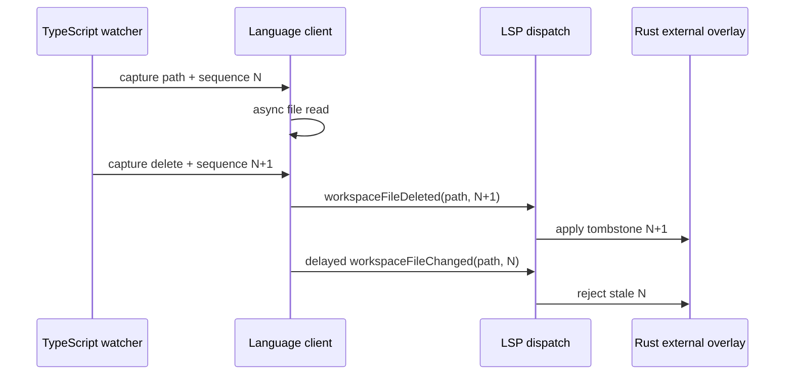
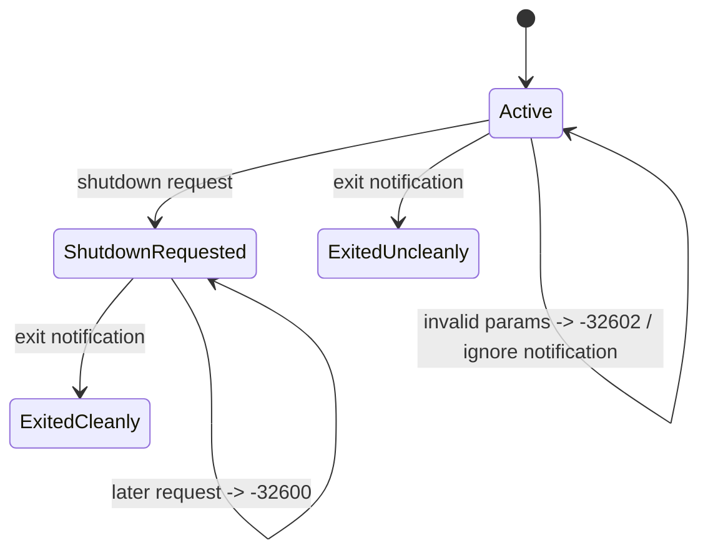

# LSP Runtime Integrity - Plan

## Goal Capsule

| Field | Plan |
| --- | --- |
| Objective | Make the language server survive malformed traffic, honor lifecycle rules, and converge deterministically under stale async work and filesystem events. |
| Product authority | The six confirmed LSP code-review findings and the existing Rust-language-engine ownership boundary. |
| Execution profile | Cross-layer Rust and TypeScript runtime hardening with framed protocol and state-interleaving regression coverage. |
| Stop conditions | No new language features, Enfusion semantic changes, workspace-wide indexing redesign, or Workbench integration work. |

---

## Product Contract

### Summary

The current LSP runtime can terminate on malformed request parameters, accept requests after shutdown, and exit successfully before shutdown.
It also has three stale-work hazards: an out-of-order watcher notification can restore old workspace content, a duplicate `didOpen` can accept an old rich-token result, and the token scheduler can wait behind a lexicographically earlier URI.
Workspace discovery must also refuse linked directories so it remains bounded to configured script roots.

### Requirements

**Protocol and lifecycle**

- R1. A syntactically valid JSON-RPC request with invalid typed parameters receives one `-32602` response when it has a request id, and the server continues to serve later messages.
- R2. Invalid-parameter notifications are logged and ignored without a response or server termination.
- R3. After `shutdown`, the server rejects later requests, accepts `exit` as the terminal notification, and reports a non-successful process outcome when `exit` arrives before shutdown.

**Runtime ordering and containment**

- R4. Workspace watcher change/delete notifications carry a monotonic per-path sequence; the external overlay applies only newer sequence values, including deletion tombstones.
- R5. Workspace startup traversal never descends through a symbolic link or junction directory, while regular `.c` files under configured roots remain discoverable.
- R6. Rich semantic-token work runs by earliest due deadline, and old work cannot populate a document re-opened at the same URI.

### Scope Boundaries

- In scope: JSON-RPC dispatch/lifecycle handling, rich-token scheduler and document identity, workspace watcher notification contract, Rust overlay ordering/discovery, focused regression tests, and matching source-reference pages.
- Out of scope: incremental parsing, semantic `modded` behavior, a new LSP transport library, new editor features, TypeScript language analysis, persistent workspace caches, and Workbench/compiler validation.

### Acceptance Examples

- AE1. A malformed `textDocument/hover` request returns `-32602`; a following valid request receives its normal response over the same framed stream.
- AE2. A watcher read begun for sequence 1 completes after a sequence-2 delete; the workspace index remains deleted.
- AE3. A `Scripts/loop` directory link back to `Scripts` cannot make startup recurse or index files outside the configured tree.
- AE4. A due rich-token job for `z.c` runs before a repeatedly rescheduled, not-yet-due job for `a.c`.
- AE5. A rich-token result from before a second `didOpen` for the same URI is discarded even when its former revision number matched the new document's old reset value.

---

## Planning Contract

### Key Technical Decisions

- KTD1. Treat typed-parameter deserialization as a per-message protocol error, not a fatal transport error. Keep framing and malformed JSON-RPC envelopes on the existing fatal transport boundary; this plan does not broaden envelope recovery.
- KTD2. Model LSP lifecycle explicitly at dispatch level: active, shutdown requested, and exited. The binary exit status derives from that lifecycle outcome rather than from receiving the string `exit` alone.
- KTD3. Ship the custom workspace-notification protocol change atomically. TypeScript and Rust share one existence-independent path key: absolute lexical normalization, slash normalization, and Windows case folding, without canonicalization. The thin client assigns a monotonic sequence for that key when it captures an event; Rust owns last-applied sequence state and tombstones, and does all parsing/indexing.
- KTD4. Use an opaque, monotonic per-URI document identity for rich-token validation rather than resetting the document revision on duplicate `didOpen`. Preserve `OpenDocument` as the owner of text, analysis, and cache invalidation.
- KTD5. Treat workspace script roots as a physical-tree boundary. Skip symbolic-link directories and Windows directory reparse points, including junctions, rather than canonicalizing and following them into arbitrary external trees.

### High-Level Technical Design

### Sequencing

Implement protocol containment before introducing the new watcher payload so each subsequent framed test has a stable error path.
Make document identity and scheduler choice changes together because both are validated inside the rich-token event path.
Then update the TypeScript/Rust watcher contract, followed by discovery hardening and reference documentation.

### Risks And Mitigations

- Required sequence fields are a private client/server contract. Update both endpoints in the same change and cover the actual notification shapes with framed server tests.
- LSP clients may send notifications without ids. Keep those failures response-free while ensuring a bad notification cannot tear down the stdio process.
- Windows link creation can require privileges. Keep the traversal test focused on the directory-entry policy and conditionally skip only the link-creation assertion when the platform cannot create a test link.
- Duplicate `didOpen` is uncommon on the normal VS Code path. Preserve the stronger invariant anyway because request ordering must not determine whether stale rich tokens can cache.

---

## Implementation Units

### U1. Contain Request Errors And Enforce Lifecycle

- **Goal:** Keep typed parameter errors local to the offending JSON-RPC message and enforce correct shutdown/exit behavior without changing normal request dispatch.
- **Requirements:** R1, R2, R3; AE1
- **Dependencies:** None
- **Files:** `server/src/lsp.rs`, `server/src/bin/reforger_language_server.rs`, `docs/reference/server/src/lsp.md`
- **Approach:** Parse the envelope far enough to preserve method and request id, then translate typed parameter failures into `-32602` for requests and log/ignore them for notifications. Keep frame read errors and invalid envelopes on their existing fatal boundary. Introduce a dispatch-owned lifecycle outcome so shutdown blocks all later requests with the chosen JSON-RPC invalid-request response, `exit` remains permitted, and the binary can distinguish clean from premature exit.
- **Patterns to follow:** Reuse `respond_error`, `run`, `run_message_channels`, and the existing framed-message test helpers; keep feature projection out of dispatch logic.
- **Test scenarios:** A framed malformed hover request with an id yields `-32602` and a subsequent valid hover/initialize request responds; malformed didOpen notification produces no response and a following request still responds; a request after shutdown receives the lifecycle error; shutdown then exit produces success; exit before shutdown returns the non-success outcome.
- **Verification:** Focused framed LSP protocol/lifecycle tests prove response ordering and continuation; source reference documentation describes the new boundary.

### U2. Preserve Rich-Token Ordering And Document Identity

- **Goal:** Run the next due semantic-token job rather than the first URI and prevent old rich-worker events from matching a reopened document.
- **Requirements:** R6; AE4, AE5
- **Dependencies:** U1
- **Files:** `server/src/lsp.rs`, `server/src/lsp/open_documents.rs`, `server/src/lsp/semantic_tokens.rs`, `docs/reference/server/src/lsp.md`, `docs/reference/server/src/lsp/open_documents.md`, `docs/reference/server/src/lsp/semantic_tokens.md`
- **Approach:** Extract a pure pending-job selector that orders `(deadline, URI)` and accepts a supplied current instant, then use it before and after scheduler wakeups. Test that selector deterministically and keep only a narrow scheduler wake-up integration test. Give each URI a server-monotonic document identity that survives replacement or duplicate `didOpen`; cancel/clear the replaced document's pending/cache state and require that identity, revision, and external generation all match before caching a worker result. Do not move document analysis or semantic-cache ownership out of `open_documents`.
- **Patterns to follow:** Preserve the single bounded scheduler, current cancellation token behavior, fast-first projection, and revision-plus-external-generation cache contract.
- **Test scenarios:** The pure selector chooses a due `z` job over a newer not-due `a` job at a supplied instant; repeated `a` rescheduling cannot delay an already due job; equal deadlines use deterministic URI tie-breaking; a narrow scheduler wake-up test proves notification causes deadline recomputation; a constructed old `RichSemanticTokensReady` event after duplicate didOpen is ignored; current-revision rich tokens still cache and request a refresh.
- **Verification:** Focused scheduler and internal-event tests demonstrate deadline ordering, cancellation, and cache admission; existing semantic-token smoke coverage remains green.

### U3. Make Workspace Watcher Updates Latest-Wins

- **Goal:** Prevent delayed file reads and reordered custom notifications from restoring deleted or superseded workspace source.
- **Requirements:** R4; AE2
- **Dependencies:** U1
- **Files:** `src/languageClient/languageClient.ts`, `server/src/lsp.rs`, `server/src/lsp/external_overlay.rs`, `docs/reference/src/languageClient/languageClient.md`, `docs/reference/server/src/lsp.md`, `docs/reference/server/src/lsp/external_overlay.md`
- **Approach:** Derive the same existence-independent protocol path key at both endpoints from an absolute lexically normalized path, normalized separators, and Windows case rules; never use canonicalization for sequence identity because delete paths may no longer exist. Allocate a monotonically increasing sequence per key when create/change/delete is captured, include it in both notification payloads, and retain the sequence across debounced flushes and delayed reads. Extend Rust notification parameters and external-overlay mutation APIs to record the last applied sequence for that key, including tombstones, and drop equal/older arrivals before parsing, indexing, generation updates, or aggregate publication. Reinitialize client sequence state with each language-client lifecycle; do not add parsing or symbol logic to TypeScript.
- **Patterns to follow:** Keep watcher registration/disposal in the language client, `ExternalIndexHandle` as the mutation owner, startup live-change/tombstone behavior, and workspace-over-game-data precedence.
- **Test scenarios:** Change sequence 1, delete sequence 2, then delayed change sequence 1 leaves no indexed file; reversed save deliveries leave only sequence 2 content; an equal sequence is ignored; a newer recreate after delete restores content; case/separator aliases and delete-after-removal map to the same sequence key; framed notification payloads deserialize with the required sequence; existing startup update/delete behavior remains correct.
- **Verification:** Focused external-overlay interleaving tests and framed LSP custom-notification tests prove the wire and state contracts; final extension test workflow compiles and exercises the TypeScript client.

### U4. Keep Workspace Discovery Inside Physical Roots

- **Goal:** Bound startup workspace scanning to real directories beneath configured script roots.
- **Requirements:** R5; AE3
- **Dependencies:** U3
- **Files:** `server/src/lsp/external_overlay.rs`, `docs/reference/server/src/lsp/external_overlay.md`
- **Approach:** Classify each directory entry before recursion and skip symbolic-link directories on all platforms plus Windows directory reparse points, including junctions. Retain normal recursion and `.c` file collection for physical entries; do not replace the boundary with canonicalized linked-tree traversal.
- **Patterns to follow:** Preserve root canonicalization/deduplication, current per-file metadata, and the startup summary/reporting shape.
- **Test scenarios:** A normal nested `.c` file is collected; a linked directory back to the root is skipped without recursion; a link to an external directory contributes no file; on Windows, a junction/reparse-point directory is skipped using the production classification path; unsupported local link setup is recorded as a release-validation limitation rather than the sole assertion of the boundary.
- **Verification:** Focused external-overlay discovery tests prove regular collection and link exclusion; manual source/doc comparison confirms the physical-root boundary.

### U5. Align Runtime References And Perform Fresh-Process Validation

- **Goal:** Leave the cross-layer protocol, lifecycle, scheduler, and discovery contracts discoverable and verified against a fresh language-server process.
- **Requirements:** R1-R6
- **Dependencies:** U1, U2, U3, U4
- **Files:** `docs/reference/server/src/lsp.md`, `docs/reference/server/src/lsp/open_documents.md`, `docs/reference/server/src/lsp/semantic_tokens.md`, `docs/reference/server/src/lsp/external_overlay.md`, `docs/reference/src/languageClient/languageClient.md`, `docs/solutions/` only if implementation reveals a durable, non-obvious lesson
- **Approach:** Update only pages whose current behavior or ownership changes: dispatch/lifecycle in `lsp.md`, document identity/cache admission in `open_documents.md`, scheduler timing in `semantic_tokens.md`, watcher ordering and link policy in `external_overlay.md`, and client sequence ownership in `languageClient.md`. Force a newly built server process and reload the Extension Development Host once so the lifecycle/watcher changes are not validated against an old binary.
- **Patterns to follow:** Follow the repository's distinct-verification-evidence guidance; retain Rust as language authority and TypeScript as a transport/watch bridge.
- **Test scenarios:** Reference pages agree with source ownership and notification fields; a fresh process serves the framed regressions; one reloaded extension host starts the newly built server without stale development-binary behavior.
- **Verification:** Documentation path/link review, fresh-process smoke validation, and a clean diff check.

---

## Verification Contract

| Check | Applies To | Done Signal |
| --- | --- | --- |
| Focused `lsp` framed protocol and lifecycle tests | U1 | Invalid parameters are contained and shutdown/exit outcomes follow the lifecycle contract. |
| Focused scheduler and rich-token event tests | U2 | Earliest due work runs and stale duplicate-open events cannot cache. |
| Focused external-overlay ordering and discovery tests | U3-U4 | Notification sequences converge latest-wins and links are not traversed. |
| `cargo test --manifest-path server/Cargo.toml` | U1-U5 | The full Rust suite passes after the focused regression coverage. |
| `npm test` | U3, U5 | The TypeScript client compiles, lints, builds the bundled server, and passes extension tests without separately repeating its prerequisites. |
| Fresh language-server process and one Extension Development Host reload | U1-U5 | Runtime validation uses the rebuilt Rust binary and current client watcher registration. |
| Documentation comparison and `git diff --check` | U1-U5 | Source-owner documentation matches behavior and the change is mechanically clean. |

---

## Definition Of Done

- Malformed typed request parameters no longer terminate either LSP loop.
- Shutdown and exit obey one explicit lifecycle contract, including a non-successful premature exit.
- Workspace watcher traffic is sequence-aware end-to-end and stale changes cannot revive a tombstoned or newer file.
- Workspace discovery never follows linked directories outside the physical root tree.
- Rich semantic-token scheduling is deadline-driven and stale events cannot match a reopened document.
- Every review finding has a focused regression test, the full Rust and extension workflows pass, and matching references describe the resulting ownership boundaries.
- The final diff contains no abandoned experimental path or stale compatibility behavior.
