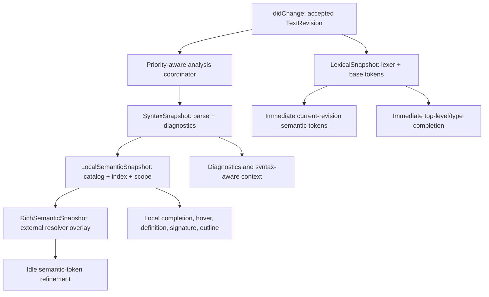

# Layered LSP Document Pipeline for Large-File Responsiveness

## Goal Capsule

- **Objective:** Replace the current all-or-nothing open-document analysis gate with a revisioned, layered Rust pipeline that gives immediate correct editor feedback while full semantic understanding converges in the background.
- **User outcome:** On `GC_MarkerArea.c`, typing a comment updates color immediately and typing `getga` shows useful completions immediately; neither interaction waits for a full-file catalog rebuild, idle debounce, or rich resolver pass.
- **Evidence:** The runtime log records a 125–129 ms full analysis dominated by 115–119 ms catalog construction, plus a 150 ms debounce. It consequently delays semantic-token responses to roughly 317–347 ms and `getga` completion to 388 ms despite finding 132 candidates. Rich semantic work takes roughly 1.9–2.3 seconds for about 1,405 resolver calls.
- **Non-goals:** Moving language intelligence into TypeScript, returning a prior revision's local facts against current text, weakening UTF-16/CRLF handling, or implementing a full incremental parser before layer contracts and evidence justify it.

---

## Product Contract

### Problem Frame

`OpenDocument` currently holds one `FileIndexAnalysis` containing lexer tokens, parse, AST-derived catalog, index, and scope. A change invalidates that entire object. `lsp.rs` then defers every source-backed request until the replacement analysis is installed. This preserves consistency but wrongly couples features with radically different data needs: comments need lexical tokens, top-level external completion needs a cursor prefix plus the external index, and parser diagnostics need syntax, while only local semantic features need the costly catalog/index/scope layer.

### Requirements

- R1. Every editor-visible result must identify an accepted document revision and use only text-derived data produced from that same revision. A lower-quality current-revision result is valid; an older local analysis projected against newer text is not.
- R2. `didChange` must accept and publish a current text revision without waiting for parsing, catalog construction, scope construction, resolver work, or external-index work.
- R3. Lexical semantic tokens for comments, strings, keywords, punctuation, operators, numbers, and preprocessor forms must be available from the current revision without full `FileIndexAnalysis`.
- R4. Top-level/type completion such as `getga` must return current-revision keyword and workspace/game-data candidates without waiting for local semantic analysis. The result may be explicitly incomplete only when exact local additions remain unavailable.
- R5. Local/member/argument completion, hover, definition, signature help, diagnostics, and symbols must retain their current semantic correctness rules: either answer from an exact matching layer or use a feature-specific pending/empty/incomplete response policy documented in code and tests.
- R6. Rich semantic-token enrichment must be an idle, low-priority refinement. It must not be scheduled merely because a client requested base tokens, compete unboundedly with typing work, or install for an obsolete revision/external generation.
- R7. The worker model must be bounded, priority-aware, latest-wins, and cooperatively cancellable at meaningful parser/catalog/resolver checkpoints. A stale task's residual work must be measurable.
- R8. Runtime evidence must separate accepted-edit latency, first usable token/completion latency, layer build durations, worker queue age/depth, stale-work cancellation tail, and rich-refresh count.
- R9. The architecture and revision-consistency documentation must describe quality tiers as a safe extension of revision consistency, replacing the old blanket rule that every source-backed request waits for full analysis.
- R10. Developer debug hover/completion captures must use the same bounded low-priority resource policy as rich analysis. A capture may be cancelled or superseded, but can never consume reserved foreground capacity.

### Acceptance Examples

- AE1. After a current-revision comment edit in the large fixture, `textDocument/semanticTokens/full` returns lexical comment tokens for that revision before any syntax or local-semantic worker result is installed.
- AE2. After typing `getga`, top-level completion returns current-revision external/keyword candidates without waiting for the local catalog; `GetGame...` candidates remain visible when the user stops typing.
- AE3. A member completion whose receiver requires current local facts never pairs new source text with the former revision's local index. It returns an explicitly incomplete/pending result or waits only for an exact current local snapshot, according to its documented contract.
- AE4. A newer edit prevents all former syntax/local/rich results from publishing. The newer revision still receives lexical feedback immediately even while cancellation of obsolete background work finishes.
- AE5. Diagnostics and outline publish only from an exact current syntax/local snapshot; a close clears diagnostics and prevents all later installations.
- AE6. Rich refinement begins only after a sustained idle period and does not create a request-loop backlog or repeated stale work during a typing burst.

### Scope Boundaries

- **In scope:** Rust open-document snapshots, LSP routing/scheduling, lexical tokens, completion tiers, exact semantic projections, runtime telemetry/reporting, synthetic performance fixtures, tests, and matching reference/solution documentation.
- **Deferred:** True incremental parsing and incremental catalog indexing. The target contracts and snapshot identities must permit those optimizations later without changing feature correctness or LSP protocol behavior.
- **Outside this product's identity:** TypeScript parsing, TextMate fallback coloring, use of Workbench/compiler as the extension's live language engine, or source-data changes.

---

## Planning Contract

### Target Architecture

### Key Technical Decisions

- KTD1. **Model immutable revisioned layers, not one mutable analysis cache.** `OpenDocument` will own accepted `TextRevision` identity plus independently installable lexical, syntax, local-semantic, and rich snapshots. Each layer records the revision and, where applicable, external-index generation. This makes current-text correctness explicit rather than inferred from one `analysis_ready` boolean.
- KTD2. **Lexical feedback is a first-class Rust language-engine layer.** Extract a lexer-only semantic-token projection that accepts current source/tokens and position conversion directly. It must not call `file_index_for_source`; the present function named `fast_semantic_tokens_for_source` does exactly that and is therefore not fast on a changed large document.
- KTD3. **Completion has explicit quality contracts.** A lexical/external fast path owns top-level/type/keyword completion and returns only facts valid for the current source and stable external indexes. Exact local/member/argument completion remains a local-semantic feature. `isIncomplete` means the current result is intentionally partial and may improve on a later request; it must not be used to hide an empty result for a common top-level case.
- KTD4. **Use a bounded coordinator with reserved foreground capacity and explicit lanes.** The ingress loop only validates protocol, accepts revision state, and routes results. One reserved foreground lane serves current lexical-token and fast-completion jobs; rich/debug work can never occupy it. One analysis lane runs syntax/local stages, then performs low-priority rich/debug work only in cancellable chunks when no current foreground or analysis job is admitted. Each lane has one in-flight job, the coordinator has global job and retained-snapshot-byte caps, and active URI/request traffic outranks inactive-document work. This is a narrow runtime scheduler in `lsp.rs`, not a new language-intelligence manager.
- KTD5. **Separate client token requests from rich-enrichment scheduling.** A semantic-token request serves the current lexical snapshot immediately. Rich work is scheduled only by a document-idle policy after an exact local snapshot exists, with a longer measured idle threshold and external-generation gate.
- KTD6. **Make heavy projections cacheable or backgrounded.** Document-symbol projection, currently capable of large request-time spikes, becomes an exact-snapshot cache/background result. Diagnostics remain syntax-layer output. Hover, definition, signature help, and local completion retain exact-layer gates instead of an unsafe stale fallback.
- KTD7. **Design for incremental implementation without pretending it already exists.** Snapshot inputs/outputs and layer ownership become stable first. If profiling still shows catalog construction violates the local-semantic budget, introduce incremental syntax/catalog work behind the same `LocalSemanticSnapshot` contract in a later plan.
- KTD8. **Treat `didOpen` as the same layered lifecycle as `didChange`.** Initial open immediately installs current text/lexical state and schedules syntax/local work through the coordinator. It must not retain a permanent synchronous full-analysis or document-symbol path. Exact diagnostics/symbols follow when their layer is ready.
- KTD9. **Refinement is driven by an explicit refresh contract.** A semantic-token response is terminal for that request. Only an exact current local/rich installation may request the existing coalesced semantic-token refresh; cancelled, stale, superseded, or closed layers never refresh. The next client token request selects the best current layer.

### Latency Contract

These budgets are for a committed, anonymized large-file fixture on a warm development machine. CI asserts dispositions and bounded work, not wall-clock values; the runtime benchmark records p50/p95/p99 against the same fixture and control file.

| Operation | Contract | Initial target | Must not depend on |
| --- | --- | ---: | --- |
| Accepted `didChange` | Update current text/revision and schedule work | p95 <= 10 ms | syntax, catalog, resolver |
| Lexical semantic tokens | Current-revision base coloring | p95 <= 50 ms | syntax/local/rich snapshot |
| Top-level/type completion | Current-revision keyword/external result | p95 <= 75 ms | local catalog build |
| Syntax build | Background exact parse/diagnostic snapshot | measured separately | catalog/resolver |
| Local semantic build | Background catalog/index/scope snapshot | measured separately | rich resolver |
| Rich refinement | Low-priority current `(revision, generation)` overlay | starts only after measured idle >= 500 ms | incoming token request |

### Migration and Compatibility Rules

- Preserve required document versions, strictly newer version acceptance, UTF-16 positions, CRLF behavior, and cancellation on close.
- During migration, no handler may read a former `LocalSemanticSnapshot` with a new `TextRevision`. Feature routing must make the required layer explicit rather than use a catch-all `source_backed_request_method` gate.
- `didOpen` installs lexical data immediately and enqueues syntax/local work through the same coordinator as `didChange`; it does not retain a synchronous full-analysis exception. Until exact syntax/local layers install, diagnostics/symbols follow their documented pending policy and never block a foreground editor request.
- The coordinator admits a bounded global number of jobs and retained snapshot bytes, retains newest work only for active/recent URIs, evicts inactive low-priority work first, and records admission/eviction/byte metrics. Active priority derives from incoming document and request traffic; any optional client-visible-document signal remains UI metadata owned by TypeScript, never language logic.
- Parser, catalog, index, scope, resolver, rich, and debug stages must either expose cooperative checkpoint/cancellation APIs or declare a measured stage-boundary tail. Rich/debug work is chunked with a measured cancellation-tail budget; local catalog construction must add traversal checkpoints before it can claim cooperative cancellation.
- Update `docs/solutions/conventions/lsp-document-revision-consistency.md`: revision consistency means “current revision plus declared layer quality,” not “all features wait for full local semantic analysis.”

---

## Implementation Units

### U1. Establish representative workload, trace schema, and regression contracts

- **Goal:** Make the current latency problem reproducible and make every subsequent layer decision observable.
- **Files:** Modify `tools/lsp-runtime-performance-report.mjs`, `tools/lsp-runtime-performance-report.test.mjs`, and `docs/reference/tools/lsp-runtime-performance-report.md`; add a committed synthetic large-file fixture and developer benchmark under an appropriate existing `server/examples/` or test-fixture owner; document its provenance and shape in the matching reference page.
- **Approach:** Derive a source-free fixture from structural properties of `GC_MarkerArea.c` (large declaration count, comments, local blocks, and top-level completion prefixes), plus a small control, a larger scale probe, and malformed/long-comment cases. Extend logs/report records with document revision, layer, request disposition (`immediate`, `incomplete`, `deferred`, `contentModified`), first-usable latency, scheduler queue age/depth, retained snapshot bytes, admission/eviction, cancellation checkpoint/tail, rich idle delay, and refresh count. Keep runtime logs source-free.
- **Test scenarios:** The report accepts legacy records; classifies new layer records; attributes events to URI/revision; excludes source text/prefix payloads; flags undersampled captures; compares large/control/scale-probe p50/p95/p99 without treating machine-dependent timing as a unit-test assertion; and identifies when full-token projection itself, rather than analysis, becomes the next scaling bottleneck.
- **Verification:** `node --test tools/lsp-runtime-performance-report.test.mjs`; benchmark harness against synthetic large/control fixtures; manual fresh `GC_MarkerArea.c` and `GC_Sounds.c` captures after each user-visible slice.

### U2. Replace monolithic open-document readiness with revisioned snapshot layers

- **Goal:** Give feature routing an explicit, safe answer to “which current-revision facts are ready?”
- **Files:** Modify `server/src/lsp/open_documents.rs`, `server/src/lsp.rs`, `server/src/ast.rs`, `server/src/model.rs`, and `server/src/scope.rs` where staged construction/cancellation requires it; add focused tests in their existing test modules; update `docs/reference/server/src/lsp/open_documents.md` and `docs/reference/server/src/lsp.md`.
- **Approach:** Split the current `FileIndexAnalysis` lifecycle into immutable `TextRevision`, `LexicalSnapshot`, `SyntaxSnapshot`, `LocalSemanticSnapshot`, and `RichSemanticSnapshot` data contracts. Extract stage constructors with explicit cancellation signatures: lexical/syntax may use documented stage-boundary tails, while catalog traversal gains bounded checkpoints before it claims cancellation. Replace `analysis_ready()` and the global request deferral classifier with feature-to-required-layer routing. Every installation checks exact revision; rich installation also checks external generation. Route `didOpen` through this same lifecycle.
- **Test scenarios:** A change/open creates a current text/lexical snapshot before syntax/local layers; stale install and close cannot publish; independent layer readiness is visible without exposing mismatched data; Unicode/CRLF positions remain revision-local; cache invalidation is limited to dependent layers; cancellation during catalog traversal reports a bounded tail.
- **Verification:** Focused `server/src/lsp.rs` and `open_documents.rs` tests, `cargo test` from `server/`, and trace evidence that accepted change time no longer includes any heavy layer.

### U3. Deliver immediate lexical semantic tokens

- **Goal:** Make comments and other lexical forms color from current text without waiting for parser/catalog work.
- **Files:** Modify `server/src/lsp/semantic_tokens.rs`, `server/src/lsp.rs`, and `server/src/lsp/open_documents.rs`; update `docs/reference/server/src/lsp/semantic_tokens.md` and `docs/reference/server/src/lsp.md`.
- **Approach:** Extract a lexer-only projection/encoding entrypoint from the current fast mode. It consumes only current-revision source, lexical tokens, and shared UTF-16 position projection; it must not create a parse, AST, catalog, index, or scope. Serve this layer immediately for `textDocument/semanticTokens/full`, retain rich/local overlays as later exact refinements, and coalesce refreshes by revision/generation.
- **Test scenarios:** A pending-local-analysis comment, string, keyword, preprocessor directive, multiline token, malformed source, CRLF, and Unicode all produce current-revision lexical tokens; a later local/rich result improves but never removes lexical-priority comment coloring; stale refinement cannot overwrite a newer lexical revision.
- **Verification:** Semantic-token unit tests, LSP channel test proving response before `DocumentAnalysisReady`, full `cargo test`, and fixture p95 capture against the lexical-token target.

### U4. Add current-revision fast completion and exact local enrichment

- **Goal:** Return useful `getga`-style completion immediately while preserving full local correctness when semantic facts are available.
- **Files:** Modify `server/src/lsp/completion.rs`, `server/src/lsp.rs`, and narrow resolver helpers in `server/src/resolver.rs` only when they can expose existing lexer-based context without duplicating parsing; update `docs/reference/server/src/lsp/completion.md` and `docs/reference/server/src/lsp.md`.
- **Approach:** Extract lexer-only cursor/prefix/range detection and use existing `IndexQuery` plus completion rendering for top-level/type keywords and workspace/game-data candidates. Return a current-revision fast list for those contexts; mark it incomplete only if an exact local-semantic list can add relevant facts. Keep member, local-scope, argument-label, override, and receiver-inference paths bound to exact current syntax/local snapshots. Where a current local query is needed before the whole catalog is ready, define a bounded cursor-local query from the syntax snapshot rather than pairing old local state with new source.
- **Test scenarios:** `getga` returns external candidates while local analysis is pending; a keyword/type prefix returns valid edit ranges for Unicode/CRLF; no fast result includes stale local declarations; member/local/argument requests follow their explicit exact-layer policy; full local completion preserves existing ranking/snippet/visibility tests; `isIncomplete` accurately reflects partial quality.
- **Verification:** Completion/resolver tests plus LSP channel tests that prove a top-level response is emitted before local semantic installation; fixture capture meets first-usable completion target and retains candidate correctness.

### U5. Stage exact syntax/local projections and remove request-time heavy work

- **Goal:** Keep diagnostics, symbols, hover, definition, signature help, and local completion correct without placing costly projection work on the typing or request loop.
- **Files:** Modify `server/src/lsp.rs`, `server/src/lsp/open_documents.rs`, `server/src/lsp/diagnostics.rs`, `server/src/lsp/completion.rs`, `server/src/lsp/hover.rs`, `server/src/lsp/definition.rs`, and `server/src/lsp/signature_help.rs` only where layer contracts require it; update their matching pages under `docs/reference/server/src/lsp/`.
- **Approach:** Publish diagnostics from `SyntaxSnapshot`; build/cache document-symbol projection from `LocalSemanticSnapshot` outside the synchronous request hot path; route exact local requests through explicit revision/layer checks. Preserve JSON-RPC cancellation/content-modified behavior only for features that cannot provide a valid lower-tier result. Do not globally defer requests that have a current-revision lexical/fast contract. Local/rich token installation requests the existing coalesced refresh only when its exact identity is still current; its response acknowledgement selects the newest available layer on the next full-token request.
- **Test scenarios:** Diagnostics never publish stale spans; outline cannot cause a large synchronous spike and remains revision-correct; hover/definition/signature/local completion never combine versions; close clears all layer outputs; stale/cancelled local/rich results never trigger refresh; a pending semantic layer does not prevent immediate lexical tokens or fast top-level completion.
- **Verification:** Existing feature suites, added lifecycle/channel tests, `cargo test`, and report evidence showing no request-loop operation above the foreground budget during the controlled burst.

### U6. Rework rich semantic refinement into a low-priority, cancellable pipeline

- **Goal:** Preserve high-fidelity resolver coloring without spending seconds of obsolete CPU or competing with current editor feedback.
- **Files:** Modify `server/src/lsp.rs`, `server/src/lsp/semantic_tokens.rs`, and cancellation-sensitive resolver paths in `server/src/resolver.rs`; update `docs/reference/server/src/lsp/semantic_tokens.md`, `docs/reference/server/src/lsp.md`, and `docs/reference/architecture.md`.
- **Approach:** Replace request-triggered rich scheduling with document-idle scheduling after an exact local snapshot exists. Implement the coordinator's reserved foreground lane, analysis lane, global admission/eviction/byte policy, and low-priority chunked rich/debug class. Rich/debug may run only when no admitted foreground/local job exists, must yield at bounded resolver checkpoints, and must never occupy the foreground lane. Retain only latest `(URI, revision, external generation)` jobs, track resolver-query/cache behavior by exact semantic dependencies, and set the final idle threshold from U1 evidence, with 500 ms as the initial floor. Apply KTD9's refresh contract exactly.
- **Test scenarios:** Repeated semantic-token requests do not enqueue duplicate rich jobs; typing cancels/evicts obsolete rich work; a running rich/debug chunk cannot delay foreground lexical/fast completion beyond the cancellation-tail budget; current local analysis takes priority over rich enrichment; many-URI bursts respect global job/byte caps and evict inactive work predictably; rich results only install/refresh for current revision/generation; cancellation stops at bounded resolver checkpoints; refresh request/acknowledgement coalesces.
- **Verification:** Scheduler/cancellation tests, `cargo test`, synthetic burst benchmark showing reduced stale-work ratio, and fresh large-file capture showing rich work does not affect first usable feedback.

### U7. Finalize architecture, learning, and runtime validation

- **Goal:** Make the new ownership model durable and verify it in the real extension host.
- **Files:** Update `docs/reference/architecture.md`, `docs/reference/server/src/lsp.md`, all changed layer/feature references, `docs/solutions/conventions/lsp-document-revision-consistency.md`, and add a focused solution record only if the final investigation yields a reusable implementation lesson beyond those owner documents.
- **Approach:** Replace wording that treats full analysis as the only safe current-revision state. Document layer contracts, scheduler ownership, exact revision/generation invariants, fixture provenance, and the evidence protocol. Build a fresh server binary, reload the active extension/development host, and run comparable controlled captures for `GC_MarkerArea.c` and `GC_Sounds.c`.
- **Test scenarios:** Documentation links/path ownership review; runtime report identifies each layer/disposition; extension host uses the fresh server binary; large/control results are comparable and no logs expose user source text.
- **Verification:** `git diff --check`; `cargo test` from `server/`; `node --test tools/lsp-runtime-performance-report.test.mjs`; `npm test`; fresh server/extension-host capture; manual comment and `getga` acceptance checks.

---

## Verification Contract

| Scope | Evidence | Done signal |
| --- | --- | --- |
| Revision correctness | Layer-install, close, stale-version, UTF-16, and CRLF tests | No result mixes current source with an older layer. |
| Lexical feedback | Pending-analysis semantic-token LSP tests | Current comment/string/keyword tokens return without syntax/local readiness. |
| Completion UX | Fast top-level/type channel tests and `getga` fixture | Current-revision external/keyword candidates return without local catalog readiness. |
| Exact semantic behavior | Existing and expanded completion/hover/definition/signature/symbol tests | Local features retain ranking, visibility, range, and lifecycle correctness. |
| Scheduler behavior | Deterministic coordinator/cancellation tests | Latest work wins; rich work is idle-only, bounded, and cannot starve foreground layers. |
| Measurement | Runtime report tests plus synthetic benchmark | Layer/disposition/queue/stale-work metrics are attributable and source-free. |
| Real editor behavior | Fresh large/control extension-host capture | p95 targets are evaluated; no foreground request waits for full catalog/rich work. |
| Full regression | `cargo test` from `server/` and `npm test` | Rust server and packaged extension remain green. |

---

## Definition of Done

- The server no longer treats `FileIndexAnalysis` as the sole usable state of an edited document.
- Current-revision lexical tokens and top-level/type completion have independently tested fast paths implemented in Rust.
- Exact local semantic features retain revision correctness without a blanket all-request deferral gate.
- Rich semantic refinement is idle-only, bounded, cancellable, and demonstrably isolated from first usable editor feedback.
- A checked-in synthetic workload and source-free runtime report make large-file regressions reproducible.
- The large-file manual capture demonstrates immediate comment coloring and visible `getga` candidates, while the small control remains healthy.
- Documentation describes the new layer contracts and supersedes the outdated full-analysis-only revision convention.
