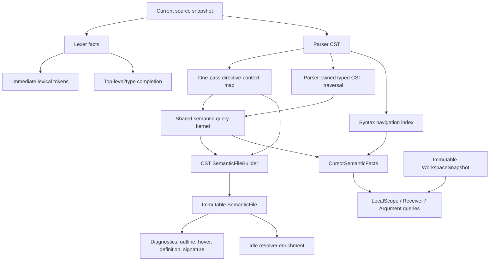

# Compiler-Centered LSP Analysis Architecture

## Goal Capsule

- **Objective:** Build one high-performance, CST-driven semantic engine for Enfusion Script and make the LSP a thin revisioned adapter over it.
- **User outcome:** Large-file comment coloring and completion are immediate and correct for the facts available in the current revision; full semantic understanding converges without stale data, CPU contention, or client-side UI retrigger tricks.
- **Measured diagnosis:** On `GC_MarkerArea.c`, parse costs about 4 ms while catalog construction costs 115–119 ms. `SymbolCatalogBuilder::push_record` recomputes preprocessor conditional context by rescanning from source start for every symbol, making the production semantic path superlinear. Rich resolver coloring then costs about 1.9–2.3 seconds for roughly 1,405 resolver calls.
- **Architectural outcome:** The authoritative path becomes `CST -> SemanticFile -> feature queries`. `AstSourceFile -> SymbolCatalog -> SymbolIndex` becomes a migration oracle only and is removed from production document/workspace analysis.
- **Non-goals:** Moving language logic into TypeScript, preserving a permanent legacy fallback, claiming incremental parsing is necessary before measurement proves it, or returning old-revision semantic facts against current text.

---

## Product Contract

### Requirements

- R1. The Rust compiler core owns a deliberately defined semantic schema, not a renamed catalog. `SemanticFile` holds immutable file facts; private `LocalSemanticRegion` data holds source-backed scope and expression facts; compact `FileContribution` records hold public exports only. Open-document and workspace indexes derive from these records and no production path retains a second semantic builder.
- R2. Semantic construction must be near-linear in source/declaration volume. Directive context is computed once, CST nodes are visited in coordinated passes, and production construction must not materialize an AST catalog then copy it into an index.
- R3. Every LSP feature uses an exact current `DocumentSnapshot` or a documented lower-quality current-revision result. No current source text may be combined with a former local-semantic snapshot.
- R4. Comments, strings, keywords, preprocessor directives, punctuation, and other lexical semantic tokens return from current-revision lexer facts without parser/catalog/index/scope work.
- R5. Top-level/type completion returns a complete useful result from the current lexical prefix, keywords, game/workspace snapshot, and a current-revision `DeclarationSummary` overlay for the active document. `isIncomplete` remains reserved for the LSP-defined capped-list meaning, not background enrichment.
- R6. Local, member, and argument completion have separate current-revision contracts. `LocalScopeQuery` uses a bounded local region; `ReceiverResolutionQuery` resolves member receivers against the captured workspace generation; and argument queries use a bounded call-site region. None waits for whole-file semantic convergence or falls back to old local facts.
- R7. One ordinary completion request produces the authoritative result for its bounded foreground deadline. The extension must remove speculative regex/timer Suggest retriggers. A custom refresh protocol is deferred behind a measured gate and is not part of the base architecture or Definition of Done.
- R8. Diagnostics, outline, hover, definition, signature help, and semantic refinement consume explicit snapshot/query contracts. They must not reintroduce synchronous whole-file projection or a blanket `analysis_ready` gate.
- R9. Rich resolver coloring and debug captures are best-effort background work. They are idle-only, globally bounded, cancellable, and never occupy capacity reserved for current lexical, syntax, or completion work. Token overlays use an explicit revision/result lifecycle over the lexical baseline.
- R10. The implementation has no production legacy fallback. Old AST/catalog behavior is used only as a test oracle during parity migration, then removed or retained solely for non-runtime compatibility where an owner explicitly requires it.

### Acceptance Examples

- AE1. A comment edit receives current-revision lexical semantic tokens before a `SemanticFile` exists for that revision.
- AE2. `getga` returns matching workspace/game-data, language, and current-file declaration-summary candidates without requiring another keystroke or waiting for full local semantic construction.
- AE3. Local, member, and argument completion use their declared current bounded query. A member completion either resolves its receiver against the captured workspace generation or returns its documented current degraded result; it never uses a previous revision's local index.
- AE4. A completion request during syntax installation runs bounded foreground syntax work and then returns a deterministic lexical/top-level result if exact local facts are unavailable; it never leaves a loading or blank state.
- AE5. One pass over a 1x, 2x, and 4x synthetic declaration fixture shows semantic-builder operation counts growing near-linearly. Parser, directive-map, semantic visitor, index-map, scope, and resolver costs remain separately observable.
- AE6. Rich/debug work running during a typing burst yields within its bounded cancellation slice; it cannot delay foreground lexical tokens or completion beyond their foreground budget.

### Scope Boundaries

- **In scope:** Compiler-core semantic construction, typed CST ownership, analysis runtime, LSP snapshot/query adaptation, removal of speculative TypeScript completion triggers, cancellation/resource scheduling, benchmarks, parity tests, and matching documentation.
- **Deferred by measured gate:** Declaration-level semantic reuse, then incremental parsing only if measurement proves they are necessary. A later incremental design must establish its own cross-revision identity invariants; this work intentionally does not pre-commit to them.
- **Out of scope:** TextMate coloring, TypeScript parsing/ranking, Workbench as a runtime analysis path, a general multi-crate rewrite, or permanent dual semantic engines.

---

## Planning Contract

### Target Architecture

### Key Technical Decisions

- KTD1. **Define the semantic schema before migration.** Create compiler-owned `SemanticFile`, private `LocalSemanticRegion`, and public `FileContribution` contracts outside `lsp/`, with language-level entities, ownership/reference edges, scopes, conditional-availability formulas, provenance, and query interfaces. The parser exposes one zero-copy typed CST traversal API (iterators/visitors, not eager vectors) that the builder consumes. Legacy catalog/index types are differential compatibility adapters only during deletion, never the new schema.
- KTD2. **Make conditional compilation context indexed data, not repeated discovery.** Build a directive/branch context map once per CST/source snapshot. Semantic records reference compact context identities; they do not each rescan source lines or clone a rebuilt branch stack.
- KTD3. **Keep identity snapshot-local until incrementality is designed.** This phase uses snapshot-local node/span IDs solely for ownership, diagnostics, and exact-revision queries; they are never cross-revision cache keys. Optional fingerprints are measurement metadata only. A cross-revision identity contract is deferred until an incremental CST design proves its invariants for insert-before-node and duplicate declarations. The present implementation rebuilds a complete exact `SemanticFile` after each paused revision.
- KTD4. **Make snapshots own position and query authority.** `DocumentSnapshot` contains one `PositionIndex` as the sole byte-span to LSP UTF-16 conversion authority, plus `LexicalSnapshot`, `SyntaxSnapshot`, navigation/recovery indexes, and a declared `QueryQuality`. Feature queries consume captured document/workspace handles and return explicit exact, recovered, or deterministic degraded results.
- KTD4a. **Make workspace state an immutable transactionally-published snapshot.** `WorkspaceSnapshot` owns `{ URI -> FileContribution }`, generation, and precedence between open-buffer, disk, and game-data sources. Replacing an unsaved contribution atomically masks its disk contribution in the same generation; queries capture one handle and never merge old/new contributions or fan out recomputation to dependent files.
- KTD5. **Use distinct foreground query paths.** Lexicalization is a bounded foreground task that atomically installs `LexicalSnapshot`. `DeclarationSummary` is extracted with syntax for active-file top-level completion. `CursorSemanticFacts` derives from current syntax, navigation, directive map, and bounded region independently of whole-file `SemanticFile`; the latter is an optional matching-revision optimization only. `LocalScopeQuery`, `ReceiverResolutionQuery`, and argument queries declare their own recovery and workspace-generation contracts.
- KTD6. **Keep completion protocol ordinary by default.** The foreground query is the authoritative response path; `isIncomplete` never means background enrichment. Delete TypeScript regex/timer suggestion triggers. A custom refresh bridge may be proposed only after representative measurements prove the bounded foreground query cannot meet the interactive SLO, and then requires a separate protocol/design decision.
- KTD7. **Run one analysis runtime outside LSP.** A Rust `analysis_runtime` owns document/workspace snapshots, task admission, cancellation, metrics, and fixed physical worker capacity. The LSP event loop only admits requests and publishes matching results. CPU-bearing work carries request ID, revision, deadline, and cancellation; foreground has physically reserved capacity and bounded ingress/bytes; semantic and rich/debug lanes have independent caps. Long work is chunked at known boundaries; non-cooperative work is isolated or discarded, never shared with foreground workers.
- KTD8. **Keep protocol adaptation thin.** `server/src/lsp.rs` translates JSON-RPC and publishes runtime results; it owns no revision state, scheduler, or semantic construction. `src/languageClient/` owns transport/process lifecycle only and contains no language logic or speculative Suggest trigger.
- KTD9. **Define token result lifecycle.** `TokenSnapshot` contains text revision, lexical baseline, optional semantic overlay, result ID/delta disposition, and overlay precedence. Refresh is coalesced best effort; stale overlays are discarded and lexical tokens remain the authoritative first feedback.
- KTD10. **Use one semantic-query kernel.** Whole-file `SemanticFile` construction and bounded cursor queries share one compiler-core semantic-query kernel: typed CST semantics, directive/conditional filtering, lookup, visibility, inheritance/member traversal, and reference resolution. Whole-file and region modes differ only in input boundary and budget; they must not become divergent semantic engines or leave `SymbolIndex`/`ReferenceResolver` authoritative.
- KTD11. **Separate active overlays from published workspace truth.** `WorkspaceSnapshot` contains only validated `FileContribution`s and `IndexedFileSnapshot`s (source handle plus `PositionIndex` for cross-file ranges). `ActiveDocumentOverlay` is a per-query, current-revision syntax product containing `DeclarationSummary` and active-file interface surface (members, bases, signatures, conditional availability). It never publishes as a workspace contribution; exact semantic completion atomically replaces the URI contribution later.
- KTD12. **Make admission latest-wins and CPU-aware.** Per URI and task class, the runtime retains at most one pending/in-flight current revision; a newer revision cancels/replaces it, bounds retained source bytes, and records a deterministic overload disposition. On one CPU, foreground runs alone; otherwise background runnable work remains below physical capacity and all rich/resolver work is chunked before admission. Non-cooperative work is isolated or dropped.
- KTD13. **Make completion quality honest.** Completion results are `Exact`, `RecoveryExact` only when candidate equivalence is proven, or `Unavailable` with a deterministic lexical/top-level fallback. Each result carries document/workspace generations, receiver-resolution state, and recovery reason. A deadline never permits stale or false members, nor a claim of completeness with omitted eligible candidates.
- KTD14. **Version and validate workspace artifacts.** `FileContribution` has schema and source-manifest versions. Decode/validate before atomic publication; cold, stale, corrupt, partial, and mixed-precedence caches rebuild safely and never retain a legacy `SymbolIndex` runtime fallback. Workbench-confirmed fixtures are the truth gate for Enfusion scope, conditional, member, and argument semantics; legacy parity is compatibility evidence only.

### Completion Quality Contract

| Result | When allowed | Candidate guarantee | Client behavior |
| --- | --- | --- | --- |
| `Exact` | Current syntax/region and all required receiver/workspace facts are available within the deadline. | Includes every eligible candidate for the declared completion context. | Ordinary complete response. |
| `RecoveryExact` | Recovery facts are proven equivalent to the valid-region query. | Same as `Exact`; otherwise this result is forbidden. | Ordinary complete response with recovery telemetry. |
| `Unavailable` | Exact candidate eligibility cannot be proven by the foreground deadline. | Returns only lexical/top-level candidates whose eligibility is independently proven; never false members or stale locals. | Deterministic non-loading fallback; `isIncomplete` is not used for background enrichment. |

### Latency and Scale Contract

| Operation | Required data | Target | CI proof |
| --- | --- | ---: | --- |
| `didChange` acceptance | revision/text identity only | p95 <= 10 ms | runtime admission only; no analysis on event loop |
| Lexical token response | foreground lexical task + position index | p95 <= 50 ms | response before syntax/semantic install |
| Top-level/type completion | lexer + workspace snapshot + active overlay | p95 <= 75 ms | `getga` result before semantic install |
| Cursor-local query | syntax navigation + region + workspace snapshot | p95 <= 50 ms | no whole-file semantic dependency |
| Whole-file semantic construction | CST + directive map | measured; near-linear scale | operation-count ratios at 1x/2x/4x |
| Rich/debug work | semantic/external snapshots | idle-only; bounded tail | foreground starts within configured slice |

Timing budgets are runtime SLOs measured on a named capture profile, not ordinary CI wall-clock gates. CI proves layer choice, no stale joins, operation counts, cancellation points, queue bounds, task disposition, and protocol behavior.

---

## Implementation Units

### U1. Define semantic contracts, truth fixtures, and a differential corpus

- **Goal:** Define the new semantic contract from Workbench-confirmed language fixtures, then use legacy output only as differential compatibility evidence.
- **Files:** Modify `server/src/model.rs`, `server/src/ast.rs`, `server/src/index.rs`, `server/src/scope.rs`, and their existing test modules only to expose source-free counters/fixtures; add a committed synthetic fixture/benchmark under the existing `server/examples/` or test-fixture owner; update matching reference documentation.
- **Approach:** Specify `SemanticFile`, `LocalSemanticRegion`, `FileContribution`, query kernel, and completion-quality contracts. Build Workbench-confirmed fixtures for scopes, declarators, conditionals, members, and arguments. Instrument scans, visits, allocations, and stages; legacy output is test-only differential evidence, never the behavioral source of truth.
- **Test scenarios:** Existing parser/model/index/scope behavior has frozen symbol names/kinds/parents/spans/conditional contexts/visibility fixtures; scale counters demonstrate the present superlinear conditional-context behavior; runtime inputs never log source text.
- **Verification:** Focused Rust tests, `cargo test` from `server/`, and a checked-in benchmark report documenting baseline ratios rather than hardware-specific pass/fail time.

### U2. Build the semantic core and public contribution boundary

**Mandatory cutover contract:** Define `SemanticFile`, private `LocalSemanticRegion`, and public versioned `FileContribution` before implementation. Refactor the parser-owned typed CST facade to zero-copy iterators/visitors; do not replace it with raw `SyntaxKind` walkers. Build workspace indexes only from validated `FileContribution` records and delete the legacy catalog builder from every production cutover.

- **Goal:** Replace `AstSourceFile -> SymbolCatalog -> SymbolIndex` as the production source of semantic facts.
- **Files:** Add compiler-core owners such as `server/src/semantic_file.rs` and `server/src/analysis_runtime/`; modify `server/src/lib.rs`, `server/src/model.rs`, `server/src/index.rs`, `server/src/index_build.rs`, `server/src/index_cache.rs`, `server/src/lsp/external_overlay.rs`, `server/src/scope.rs`, and `server/src/ast.rs`; update matching source-owner pages.
- **Approach:** Build a directive-context map once, then visit CST declaration/class-member/declarator/parameter/local nodes directly. Each CST node and directive line is visited O(1) per named builder phase; in particular, replace the existing per-callable root scope walk. Emit immutable declaration records, snapshot-local node/span IDs, symbol lookup maps, scope ownership, and conditional-context IDs in coordinated passes. Define a `SemanticFile` index-ingress/export contract (file metadata, contribution generation, and serialized external-index representation), then migrate `index_build` and `external_overlay` plus open-document construction to use it. Publish immutable workspace generations by atomic contribution replace/remove, overlaying an unsaved active document. Keep AST wrappers only for read-only syntax views; forbid them from rebuilding production semantic representation. Use parity tests against U1's oracle during migration, then remove the old production builder call path.
- **Test scenarios:** Classes, enums, typedefs, globals, fields, multi-declarators, constructors/destructors, generic parameters, locals, loop locals, malformed declarations, conditional branches, doc comments, Unicode, and CRLF match the oracle contract; open-document, `index_build`, and `external_overlay` outputs match their existing contracts; per-phase CST counters reject per-callable root walks; source visits and directive scans scale near-linearly.
- **Verification:** Model/index/scope/resolver regression suites, semantic parity fixtures, scale-counter tests, `cargo test`, and code search proving open-document/workspace indexing no longer calls the legacy catalog builder.

### U3. Build the final analysis runtime and foreground document slices

**Mandatory runtime contract:** `analysis_runtime`, outside `lsp/`, owns snapshots, workspace publication, fixed worker capacity, admission, deadlines, cancellation, and metrics. The JSON-RPC loop only admits and publishes tasks. `didOpen` and `didChange` submit work; a bounded foreground lexical task installs lexical/position state, and syntax installs navigation plus a current-file `DeclarationSummary` overlay.

**Semantic-build rule:** U3 also owns `SemanticFile` admission, latest-wins cancellation, dependency order, and matching-revision publication from its first cutover. U6 adds rich/debug clients only; it never introduces or changes the semantic-build scheduler.

- **Goal:** Establish the final non-blocking runtime and ship lexical tokens plus top-level completion as the first complete foreground slice.
- **Files:** Add or modify a narrow Rust document-snapshot owner under `server/src/`; modify `server/src/lsp/open_documents.rs`, `server/src/lsp.rs`, `server/src/lsp/semantic_tokens.rs`, `server/src/lsp/completion.rs`, `server/src/lsp/diagnostics.rs`, and `server/src/resolver.rs`; update matching LSP reference pages.
- **Approach:** Implement `analysis_runtime` outside `lsp/`: event-loop-only admission/publication; request ID, revision, deadline, cancellation, latest-wins state, fixed CPU-aware capacity, byte/job caps, and overload disposition. `didOpen` and `didChange` only submit snapshots. A foreground lexical task installs `LexicalSnapshot` and `PositionIndex`; syntax installs navigation and `ActiveDocumentOverlay`, never an unvalidated workspace contribution. In the same unit, schedule/cancel/publish full `SemanticFile` builds. Migrate lexical tokens and top-level completion, deleting their former readiness authority.
- **Test scenarios:** Current comment tokens arrive with semantic pending; top-level/type completion reads the captured workspace plus active-document overlay; stale/closed snapshots cannot install; unsaved add/rename/delete, duplicate/shadowed names, close/reopen, and external generation changes update workspace visibility safely; `PositionIndex` handles Unicode, CRLF, and EOF positions; latest-wins semantic admission/publish rejects obsolete revisions; foreground admission remains available under saturated background work.
- **Verification:** Analysis-runtime and LSP channel tests, lexical-token/top-level-completion tests, workspace snapshot tests, and a no-global-deferral test demonstrating independent layer routing.

### U4. Add bounded local, receiver, and argument completion queries

- **Goal:** Deliver exact current local, receiver, and argument completion without whole-file waits or client-side retriggering.
- **Files:** Modify `server/src/lsp/completion.rs`, `server/src/lsp/hover.rs`, `server/src/lsp/definition.rs`, `server/src/lsp/signature_help.rs`, `server/src/lsp/semantic_tokens.rs`, `server/src/lsp/debug_hover.rs`, `server/src/lsp.rs`, and their matching reference pages.
- **Approach:** Build declaration/block/recovery navigation and one shared semantic-query kernel. Implement `LocalScopeQuery`, `ReceiverResolutionQuery`, and argument queries over current `LocalSemanticRegion`, `ActiveDocumentOverlay`, and one captured `WorkspaceSnapshot`; receiver resolution covers locals, parameters, fields, and bounded chained expressions. Define `Exact`/`RecoveryExact`/`Unavailable` candidate eligibility and recovery semantics. Delete TypeScript edit timers, regexes, and completion-trigger configuration; ordinary edits never call `triggerSuggest`.
- **Test scenarios:** Locals, parameters, fields, and bounded chained receivers are exact on valid current text; malformed local/member/argument queries return their declared completion-quality outcome; query paths do no root walk; a CPU-burning semantic task cannot block foreground completion; ordinary edits never trigger Suggest from TypeScript.
- **Verification:** Full existing LSP feature suite plus focused channel tests and `cargo test`.

### U5. Migrate remaining feature queries and diagnostics

- **Goal:** Move hover, definition, signature, outline, diagnostics, and token refinement to explicit runtime query contracts.
- **Files:** Modify `server/src/lsp/hover.rs`, `server/src/lsp/definition.rs`, `server/src/lsp/signature_help.rs`, `server/src/lsp/diagnostics.rs`, `server/src/lsp/semantic_tokens.rs`, `server/src/lsp.rs`, and matching reference pages.
- **Approach:** Use snapshot-bound positions and `QueryQuality` in every result. Parser diagnostics publish and clear from current syntax; semantic diagnostics replace only matching-revision results. Define `TokenSnapshot` baseline/overlay/result-ID policy. A custom completion-refresh bridge remains out of scope unless U7 telemetry triggers a separately approved design.
- **Test scenarios:** UTF-16/CRLF property corpus, malformed diagnostics publish and repair clears, stale diagnostics/features never publish, hover/definition/signature/symbols use snapshot-bound target ranges, and semantic-overlay conflicts resolve deterministically.
- **Verification:** Rust feature/channel tests, extension tests, and manual large/control-file capture.

### U6. Add bounded convergence scheduling and best-effort rich refinement

**Sequencing rule:** U6 adds rich/debug clients to U3's final executor interface; it must not introduce a second scheduler, worker pool, or transition queue.

- **Goal:** Isolate whole-file semantic convergence, rich resolver coloring, outline projection, and debug captures from foreground interaction.
- **Files:** Modify `server/src/lsp.rs`, `server/src/lsp/open_documents.rs`, `server/src/lsp/semantic_tokens.rs`, `server/src/lsp/debug_hover.rs`, `server/src/resolver.rs`, and documentation under `docs/reference/server/src/lsp/` plus `docs/reference/architecture.md`.
- **Approach:** Extend U3's owned executor with bounded semantic and low-priority rich/debug lanes. Add global job/snapshot-byte caps, active-URI priority, fair admission, inactive eviction, cooperative checkpoints at declaration/class-member/local-block/resolver boundaries, a measured maximum poll/tail duration, and explicit residual-tail telemetry. Compute/cache outline from exact `SemanticFile` outside request hot paths. Rich refresh is coalesced and optional; debug captures are cancellable low-priority jobs. A non-cooperative resolver cannot be admitted to shared foreground capacity.
- **Test scenarios:** Saturated semantic plus rich/debug work still permits a foreground request within the stated tail budget; injected non-cooperative resolver work is deferred/dropped without stale publication; many-URI bursts respect job/byte caps; close and external-generation changes cancel safely; outline cannot produce a long request-loop stall; repeated token requests do not duplicate rich jobs; stale work never refreshes or publishes.
- **Verification:** Deterministic scheduler tests, cancellation tests, full Rust suite, and controlled runtime capture.

### U7. Prove the target under real workload and remove migration scaffolding

- **Goal:** Verify the architecture in the extension host and leave one durable source of truth.
- **Files:** Modify `tools/lsp-runtime-performance-report.mjs`, `tools/lsp-runtime-performance-report.test.mjs`, relevant docs under `docs/reference/`, and `docs/solutions/conventions/lsp-document-revision-consistency.md`; remove obsolete production compatibility code identified by U2/U4.
- **Approach:** Report first usable token/completion latency, semantic-builder stage/counter ratios, snapshot quality, foreground admission/overload disposition, workspace generation, rich/debug cancellation tail, and source-free captures. Measure runtime SLOs on a named capture profile; CI proves structural invariants. Update documentation to state that revision consistency means exact current snapshot plus declared query quality. Remove legacy production paths once parity and runtime gates pass.
- **Test scenarios:** Report parses legacy/new records, protects source text, compares large/small/scale fixtures, and flags undersampling; fresh server binary and reloaded extension host run the current implementation; `GC_MarkerArea.c` and `GC_Sounds.c` captures are comparable.
- **Verification:** `node --test tools/lsp-runtime-performance-report.test.mjs`; `cargo test` from `server/`; `npm test`; `git diff --check`; fresh extension-host capture; manual comment, `getga`, and member-completion acceptance checks.

---

## Verification Contract

| Scope | Evidence | Done signal |
| --- | --- | --- |
| Semantic-engine correctness | Oracle parity and compiler-core tests | One CST-driven `SemanticFile` is authoritative in production. |
| Algorithmic performance | 1x/2x/4x operation counters | Directive context and semantic construction scale near-linearly. |
| Revision safety | Snapshot/install/close/UTF-16/CRLF tests | No feature combines current text with older local facts. |
| Immediate UX | Pending-semantic lexical and top-level completion tests | Comment tokens and `getga` return before whole-file semantic construction. |
| Exact completion | Local/receiver/argument query tests | Results are current, bounded, and deterministically degraded only for documented recovery cases. |
| Background isolation | Scheduler/cancellation/cap tests | Rich/debug cannot occupy foreground capacity or publish stale output. |
| Real editor behavior | Fresh large/control captures | Typing is responsive, `getga` is visible, and rich work is non-disruptive. |
| Regression | `cargo test` and `npm test` | Server, extension, and packaging behavior remain green. |

---

## Definition of Done

- Production semantic construction is CST-driven and no longer routes through the legacy AST catalog/index pipeline.
- The demonstrated superlinear directive-context rebuild is removed and scale counters prove the replacement's growth behavior.
- The LSP exposes current-revision lexical feedback and complete top-level/type completion independently of whole-file semantic convergence.
- Exact local/member/argument completion uses current bounded local/receiver/argument facts; ordinary edits never cause TypeScript Suggest retriggers.
- Rich semantic tokens and debug captures are optional, bounded, cancellable refinements with no foreground correctness or latency role.
- All feature queries use one compiler-core semantic authority; temporary oracle/scaffolding is removed from runtime production paths.
- Fresh real-file captures demonstrate immediate comment coloring, visible `getga` completion, healthy member completion, and no large-file regression.
