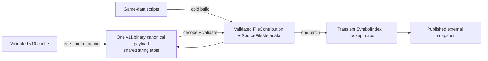

# Compact Canonical Game Data Cache

## Goal Capsule

- **Objective:** Replace the duplicated v10 game-data cache payload with one canonical, bounded binary representation of public semantic facts.
- **User outcome:** The game-data cache remains fast and safe to load while returning near its earlier ~27 MiB footprint instead of 94 MiB.
- **Scope:** Persistent game-data index format, compatible migration, observability, tests, and the owning reference pages.
- **Non-goals:** Compressing an already duplicated format, weakening cache validation, changing completion semantics, persisting workspace indexes, or adding a second runtime index representation.

---

## Product Contract

### Problem Frame

The v10 cache persists `IndexedFile`/`IndexedSymbol` records and a JSON-encoded `FileContribution` projection of those same public facts. The runtime reconstructs `SymbolIndex` only from the contribution projection, so the first representation is stored only to manufacture the second. On the current game-data corpus this produces a 93,750,056-byte cache for 27,640,746 bytes of source.

### Requirements

- R1. Persist exactly one authoritative public semantic representation per game-data file: source metadata plus its validated `FileContribution`.
- R2. Encode that representation in the cache's bounded binary codec and shared string table; no JSON payload or serialized `IndexedSymbol` graph remains in the current format.
- R3. Rebuild transient `SymbolIndex` records and lookup maps only from the canonical decoded contributions before publication.
- R4. Valid current v10 caches migrate atomically to the compact format without source parsing; malformed, stale, or identity-mismatched caches rebuild safely.
- R5. The production 6,495-file / 143,145-symbol game-data capture produces a cache at or below 30 MiB, with a 32 MiB regression ceiling pending corpus growth; the cache-size metric is logged with ready-state timing.
- R6. Cache corruption, bounds violations, schema/version mismatch, migration failure, and semantic-contract failure cannot publish a partial or legacy runtime index.
- R7. Completion, definition, hover, callable signatures, source precedence, and current cache-load behavior remain behaviorally equivalent after a cold build, v10 migration, and compact-cache load.

### Acceptance Examples

- AE1. A newly built cache contains only v11 metadata, the shared string table, and one metadata-plus-contribution record per file; it has no JSON contribution section or cached symbol records.
- AE2. A valid v10 cache with the matching fingerprint loads, validates, rewrites atomically as v11, and exposes the same lookup results without reading scripts.
- AE3. A truncated, oversized, malformed, or wrong-fingerprint v10/v11 file is rejected and rebuilt rather than queried.
- AE4. A fresh server log reports the compact cache byte count and a ready external index; a subsequent server start reports a cache hit.

### Scope Boundaries

- **In scope:** `server/src/index_cache.rs`, codec support needed by its canonical record, external-index ready telemetry, cache tests, and matching reference pages.
- **Out of scope:** General-purpose compression, cache splitting, persistent workspace caching, changing `FileContribution` language semantics, or downloading game data.

---

## Planning Contract

### High-Level Technical Design

### Key Technical Decisions

- KTD1. **Make contributions canonical.** Persist `SourceFileMetadata` beside each versioned `FileContribution`; reconstruct `IndexedFile`, `IndexedSymbol`, and all lookup maps from those records. This removes the stored duplicate rather than trying to shrink it with compression. (session-settled: user-directed — chosen over retaining the duplicate graph: no duplicated effort or JSON payload.)
- KTD2. **Use the existing bounded binary/string-table codec.** Add explicit binary read/write routines for public contribution fields and metadata, with per-vector, string-table, and total-payload limits. Do not serialize contributions with `serde_json`, because a JSON sub-payload bypasses the cache's compact string interning and duplicates syntax.
- KTD3. **Migrate v10 once, do not retain it.** A matching v10 cache may be decoded through its existing strict path, projected to the canonical records, validated, and atomically rewritten as v11. v9 remains a compatibility input only as required to reach the current canonical format; no legacy query path survives publication.
- KTD4. **Measure byte size as an external-index contract.** The ready log includes `cache_file_bytes`; focused tests expose encoded-section and full-cache size ratios on deterministic fixtures. The actual downloaded corpus is the release gate for the 30 MiB target, not a hardware-sensitive CI fixture.
- KTD5. **Keep lookup maps transient.** The persisted format stores facts, not derived query structures. Reconstruction uses `add_file_contributions` so maps build once per cache load, preserving the corrected linear batch behavior.

### Risks & Dependencies

- The 30 MiB target depends on repeated strings and public-fact volume in the downloaded corpus; the v11 codec must be measured before treating it as met. If one canonical binary representation cannot meet the target, profile its field-level sizes before proposing any compression or lossy pruning.
- v10 migration has to preserve file order, source precedence metadata, dense public IDs, parent edges, callable facts, and conditional contexts exactly. A migration mismatch must trigger source rebuild, never a partial publication.
- Cache decoding is untrusted-file input. Every count and byte length must remain bounded before allocation, and atomic replacement must preserve the existing Windows-safe write behavior.

---

## Implementation Units

### U1. Define and encode the canonical v11 cache record

- **Goal:** Replace duplicated v10 serialized index records plus JSON contributions with a single binary canonical file-record sequence.
- **Requirements:** R1, R2, R3, R6.
- **Files:** Modify `server/src/index_cache.rs`; add or extend only its focused test module; update `docs/reference/server/src/index_cache.md`.
- **Approach:** Introduce v11 magic/version/index-shape identifiers and a `CachedFileContribution` record containing source metadata plus `FileContribution`. Replace `CachedSymbolIndex` as the current persisted payload. Encode/decode every public semantic field with the cache's binary primitives and one interned string table; preserve explicit bounds and EOF checks. Decode, validate all contributions, then batch-reconstruct the transient `SymbolIndex` before publication.
- **Test scenarios:** Round-trip classes, members, parameters, docs, attributes, modifiers, conditions, CRLF/Unicode text, and source metadata; reject trailing bytes, invalid enum values, oversized counts/strings/payloads, sparse IDs, missing parents, and invalid source manifests; prove no current encoder path invokes JSON serialization or emits serialized indexed-symbol records.
- **Verification:** Focused `index_cache` tests, `cargo test --lib`, codec-size assertions on a representative multi-file fixture, and `git diff --check`.

### U2. Migrate existing cache artifacts safely

- **Goal:** Preserve a fast upgrade path from valid v10/v9 bytes while removing every legacy runtime representation after the rewrite.
- **Requirements:** R4, R6, R7.
- **Files:** Modify `server/src/index_cache.rs` and its tests; update `docs/reference/server/src/index_cache.md` and `docs/reference/src/languageClient/languageClient.md` only if the externally visible cache contract changes.
- **Approach:** Treat v10 as a strict one-way input: decode the existing format, validate identity and contribution contract, pair its file metadata with validated contributions, write v11 atomically, then reconstruct only from canonical records. Preserve the existing v9-to-current compatibility gate without retaining a v9/v10 `SymbolIndex` query path. Use a distinct current cache filename or update the documented content-version contract so the client never mistakes stale bytes for current bytes.
- **Test scenarios:** Matching v10 migrates without invoking source build; matching v9 reaches v11 through the compatibility path; wrong crate/schema/fingerprint, malformed file ranges, corrupt contribution bytes, failed replacement, and interrupted writes rebuild safely; migrated and cold-built indexes return identical class/function/member/signature results.
- **Verification:** Focused migration and failure-injection tests, full `cargo test` from `server/`, and a code search confirming only v11 records feed current runtime reconstruction.

### U3. Establish cache-size and startup evidence

- **Goal:** Make cache footprint and warm-load performance observable, enforceable, and easy to validate in the extension host.
- **Requirements:** R5, R7.
- **Files:** Modify `server/src/lsp/external_overlay.rs`, relevant `server/src/index_cache.rs` tests, `docs/reference/server/src/lsp/external_overlay.md`, `docs/reference/server/src/index_cache.md`, and, if needed, `tools/lsp-runtime-performance-report.mjs` plus its test file.
- **Approach:** Include the optional cache byte count in the game-data ready log and safe runtime report fields. Add deterministic fixture-scale checks proving the canonical codec is materially smaller than the v10 equivalent and does not duplicate public strings. Record the production capture gate: current corpus cache <=30 MiB (hard regression ceiling 32 MiB), cold build reaches ready, and the next fresh server reports cache load rather than rebuild.
- **Test scenarios:** Ready logs include bytes for rebuilt, loaded, and migrated caches without source content; report parser accepts the new field and preserves its source-free guarantee; fixture comparison fails if an additional serialized public graph or JSON payload is reintroduced.
- **Verification:** Rust tests, `node --test tools/lsp-runtime-performance-report.test.mjs` when changed, fresh packaged server, one cold production-corpus build, one warm restart, and manual `getga` completion validation after the ready state.

### U4. Update documentation and remove obsolete cache claims

- **Goal:** Leave the cache owner documentation aligned with one canonical persisted semantic representation.
- **Requirements:** R1–R7.
- **Files:** Modify `docs/reference/server/src/index_cache.md`, `docs/reference/server/src/index.md`, `docs/reference/server/src/lsp/external_overlay.md`, and `docs/reference/architecture.md` only where it describes persisted external-index facts.
- **Approach:** Replace v10 duplicated-payload language with v11 ownership, migration, bounded decoding, derived-map reconstruction, byte-size telemetry, and the measured corpus target. Remove obsolete migration details rather than layering contradictory history on top.
- **Test scenarios:** Documentation links resolve; owner pages distinguish durable persisted facts from transient lookup maps and do not claim JSON contributions are current.
- **Verification:** Manual owner-page/link review and `git diff --check`.

---

## Verification Contract

| Scope | Evidence | Done signal |
| --- | --- | --- |
| Canonical storage | Codec and round-trip tests | One binary metadata-plus-contribution record per file; no JSON or serialized symbol graph. |
| Safety | Corruption, bounds, and migration tests | Invalid bytes never publish and fall back to safe rebuild. |
| Query parity | Cold, migrated, and warm-loaded index tests | Lookup, signature, source precedence, and completion inputs match. |
| Size | Deterministic fixture ratio plus production capture | Production game-data cache <=30 MiB; never exceeds 32 MiB without an approved revised target. |
| Startup | Fresh cold and warm server logs | Cold rebuild reaches ready; next start is a cache hit with byte/timing telemetry. |
| Regression | `cargo test` from `server/`; `npm test` if TypeScript/tooling changes | Server and extension behavior remain green. |

## Definition of Done

- The current cache format serializes no duplicate `IndexedSymbol`/`IndexedFile` graph and no JSON contribution payload.
- A valid v10 cache upgrades atomically without reparsing sources; invalid legacy/current bytes rebuild safely.
- The current game-data corpus cache is at or below 30 MiB, with a documented 32 MiB ceiling and source-free byte telemetry.
- A cold build and warm cache-hit start publish the same external index and preserve `getga` completion behavior.
- Tests, reference docs, and fresh extension-host evidence cover the format, migration, safety, size, and lifecycle.
