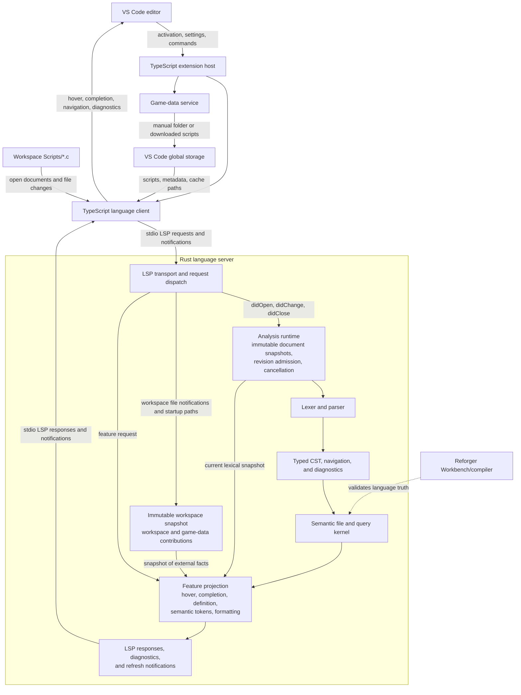

# Architecture Overview

## Purpose

Defines the canonical runtime data flow and ownership boundaries for Reforger
Script Tools. Read this page before making a cross-layer change; read the
matching source-owner page for implementation details.

## Runtime Data Flow

Open documents enter a compiler-owned analysis runtime that admits immutable,
revisioned snapshots. Lexical feedback, syntax/cursor queries, whole-file
semantic construction, and rich resolver refinement have distinct contracts;
no feature may combine current text with old local semantic facts. Feature
handlers consume the minimum current snapshot layer they need plus one immutable
workspace/game-data snapshot, then return protocol-shaped results. Background
indexing may refresh external facts, but it never moves language intelligence
into the TypeScript client.

## Ownership

| Layer | Owns | Must Not Own |
| --- | --- | --- |
| VS Code extension host | Activation, commands, configuration, user-facing prompts, global-storage paths, process lifecycle, and editor integration | Parsing, semantic analysis, indexing, or feature-specific language decisions |
| Game-data service | Resolving manual/downloaded game scripts and maintaining their global-storage metadata | Language parsing, semantic modeling, or Workbench validation |
| TypeScript language client | Bundled-server resolution, stdio transport, document/watch notifications, and thin rendering bridges | Tokenization, symbol lookup, completion ranking, hover generation, or type reasoning |
| Rust language server | Analysis runtime, lexing, parsing, typed CST, semantic/query model, workspace/game-data snapshots, diagnostics, formatting, and LSP handlers | VS Code commands, UI prompts, extension settings, and game-data download flows |
| Workbench/compiler | Ground-truth validation of uncertain Enfusion Script behavior | Runtime LSP service or extension architecture |

## Data Boundaries

- Workspace scripts enter Rust through LSP document traffic and debounced
  file-change notifications from the TypeScript client.
- Reforger game data is a user-selected manual folder or data downloaded under
  VS Code global storage. The client passes resolved locations and metadata to
  Rust, which treats them as external language facts.
- Rust returns protocol-shaped results. The client forwards or renders them; it
  does not recreate language decisions.
- Logs, downloaded data, metadata, and indexes stay under `globalStorageUri`,
  never in the user workspace or packaged extension files.
- Diagnostic performance logs are separate JSONL streams owned by the extension
  host and Rust server. They contain only bounded operational metadata, never
  document text or LSP payloads.
- Workbench/compiler evidence changes the project's understanding of language
  truth. It does not create a second runtime analysis path.

## Entry Points

- [src/extension.ts](src/extension.md): activation and top-level service wiring.
- [src/gameData/gameData.ts](src/gameData/gameData.md): game-data acquisition and source resolution.
- [src/languageClient/languageClient.ts](src/languageClient/languageClient.md): server process, protocol, editor-event, and rendering bridge.
- [server/](server.md): Rust language-engine subsystem map.

## Maintenance Boundary

Update this page only when cross-layer ownership, runtime flow, or a data
boundary changes. Keep feature contracts and implementation mechanics in their
matching source-owner pages. Developer tooling and generated reports are outside
this runtime architecture.
