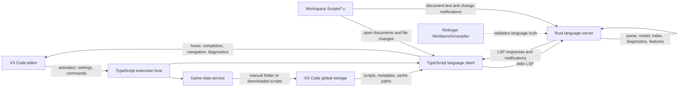

# Architecture Overview

## Purpose

Defines the canonical runtime data flow and ownership boundaries for Reforger Script Tools. Use this page to orient architectural work before reading the matching source-owner pages.

## Runtime Data Flow

## Ownership

| Layer | Owns | Must Not Own |
| --- | --- | --- |
| VS Code extension host | Activation, commands, configuration, user-facing prompts, global-storage paths, process lifecycle, and editor integration | Parsing, semantic analysis, indexing, or feature-specific language decisions |
| Game-data service | Resolving manual/downloaded game scripts and maintaining their global-storage metadata | Language parsing, semantic modeling, or Workbench validation |
| TypeScript language client | Bundled-server resolution, stdio transport, document/watch notifications, and thin rendering bridges | Tokenization, symbol lookup, completion ranking, hover generation, or type reasoning |
| Rust language server | Lexing, parsing, AST/syntax, semantic model, workspace/game-data indexes, diagnostics, formatting, and LSP handlers | VS Code commands, UI prompts, extension settings, and game-data download flows |
| Workbench/compiler | Ground-truth validation of uncertain Enfusion Script behavior | Runtime LSP service or extension architecture |

## Data Boundaries

- Workspace scripts enter the Rust server through open-document LSP traffic and debounced file-change notifications from the TypeScript client.
- Reforger game data is either a user-selected manual folder or downloaded under VS Code global storage. The client passes resolved paths and metadata to Rust; Rust uses them as external language facts.
- Rust returns protocol-shaped feature results. The client renders or forwards them, but does not recreate language decisions.
- Runtime logs, downloaded data, metadata, and indexes stay under `globalStorageUri`, not in the user workspace or packaged extension files.
- Workbench/compiler validation changes the project’s understanding of language truth; it does not introduce a second runtime analysis path.

## Entry Points

- [src/extension.ts](src/extension.md): activation and top-level service wiring.
- [src/gameData/gameData.ts](src/gameData/gameData.md): game-data source resolution and update flow.
- [src/languageClient/languageClient.ts](src/languageClient/languageClient.md): server process, protocol, editor-event, and rendering bridge.
- [server/](../../server/): Rust language-engine implementation and its matching `docs/reference/server/` pages.

## Change Notes

Added as the single architecture overview after the project outgrew per-file documentation as the only discovery path. The diagram is intentionally runtime-focused: developer tooling and generated reports remain outside this data flow.

## Future Improvements

Update this page only when runtime ownership or a data boundary changes. Keep feature-specific behavior in the matching source-owner page instead of expanding this overview into an implementation log.
